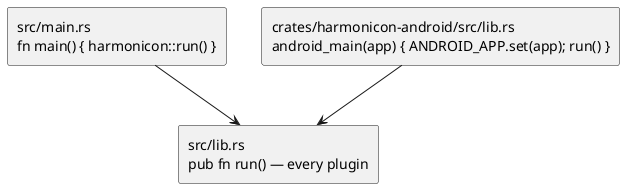

# Android

The Android port builds a real, installable APK and runs. This chapter is
the *architectural* half — the shape the port forced on the codebase, and
the traps that cost the most time. For build commands, emulator setup and
the current verified/unverified split, see [Building and Running on
Android](android-build.md).

## Android inverted the entry point

Android never calls a `main`. The platform loads a shared object and calls
`android_main`, handing over an `AndroidApp` that owns the event loop and
the JNI handles. That single fact reshaped the workspace root.

The composition root moved out of `src/main.rs` into **`src/lib.rs`'s
`run()`**, so both entry points are thin wrappers around one shared
assembly:

The cdylib is **its own crate** rather than a second `crate-type` on the
root package, because `default-members` includes every workspace member: a
cdylib on the root would relink the entire Bevy app on every desktop
`cargo build`. Instead `harmonicon-android`'s dependency on the game is
target-gated and its `lib.rs` is entirely `#[cfg(target_os = "android")]`,
so off Android it compiles to an empty cdylib with no dependencies —
measured at 4.2 MB with zero Bevy symbols, against a 517 MB desktop
binary.

`harmonicon-android` is therefore the one crate that sits *above* the root
package in the layering, and the only cdylib.

## Assets live inside the APK

An APK's assets are inside the archive, reachable only through the JNI
`AssetManager`. `std::fs::read_dir("assets/songs")` returns `Err`, so the
runtime scans find nothing at all.

This is the same constraint wasm already had, so Android reuses the same
solution — the `#[cfg]`-split scan functions backed by a
`build.rs`-generated manifest described in [Chart Format and Asset
Loading](chart-and-assets.md) and [Native vs. WebAssembly](
cross-platform-wasm.md). The predicate widened from `wasm32` to
`any(target_arch = "wasm32", target_os = "android")`.

The framing that matters: the condition is **"this target's `assets/` is
not a readable local directory"**, not "this target is not desktop". iOS
is deliberately *excluded* — an app bundle's Resources directory reads
like any other, so iOS keeps the runtime scan and the `~/Harmonicon`
drop-folder dynamism that comes with it.

Doing this surfaced that **lessons were broken on wasm too**:
`lessons::catalog` had no manifest path at all, because it reads each
`lesson.json`'s bytes directly rather than through `AssetServer`. It needed
its own build script (`OUT_DIR` is per-package) embedding the JSON text
with `include_str!`, not just directory names. Fixing Android fixed the
web build's silently-empty Lessons menu.

## Two failures that only appear at runtime

Both compiled cleanly, packaged cleanly, and passed every static check on
the APK. This is the argument for keeping an emulator in the loop rather
than trusting a green build.

**`ClassNotFoundException` for `GameActivity`** — while the class *was* in
`classes.dex`. The real cause hid in a *suppressed* exception:
`NoClassDefFoundError: AppCompatActivity`. `GameActivity` extends it, but
`games-activity`'s POM declares **no dependencies at all**, so appcompat
was never pulled in transitively.

**`NoSuchMethodError` on `Application.requestPermissions`** —
`ndk_context::android_context()` is the obvious way to reach the app
context from Rust and is wrong for this: `android-activity` registers the
**`Application`** there, not the `Activity`. `Application` is a `Context`,
so `checkSelfPermission` resolves and appears to work, while
`requestPermissions` — declared on `Activity` — throws. The Activity comes
from `AndroidApp::activity_as_ptr`.

That one also cascaded: a throwing JNI call leaves the exception *pending*
on the thread, so every later call fails with the same opaque "Java
exception was thrown", once per frame, never showing the cause.
`permission.rs`'s `with_activity` now calls
`exception_describe`/`exception_clear`, which is what surfaced the real
error in logcat.

## Version and API constraints that fail late

- **The GameActivity AAR version is pinned to the C++ vendored in the Rust
  crate.** `android-activity`'s `GameActivity.h` declares version 4.4.0, so
  Gradle pins `androidx.games:games-activity:4.4.0`. A mismatch aborts in
  `RegisterNatives` at *runtime*.
- **API 28 is a hard floor.** cpal links `libaaudio`, which only exists in
  the NDK sysroot from API 26 up; below it the link fails with a bare
  `unable to find library -laaudio`.
- **The Android-only Bevy feature selection lives in
  `harmonicon-android`'s own `Cargo.toml`**, not the root package, so
  `cargo ndk -p harmonicon-android` keeps it. On the root package, `-p`
  silently drops it and you get a build with no activity backend.

## Persistence had to move

`dirs::config_dir()` returns `None` on Android — an app has no XDG config
directory, only a sandbox — so every save silently no-opped and all
progress vanished on exit. See [Persistence](persistence.md) for
`harmonicon_platform::paths::config_dir`, the `#[cfg]`-split single answer
to "where do we write".

## What the port has *not* established

It runs on an emulator. Nobody has played a harmonica into a phone, and
that is the whole product: an emulator opening a capture stream says the
plumbing is connected, not that pitch detection survives a phone mic's AGC
and noise suppression. Touch gestures are likewise emulator-only — and
can't be scripted there, since `adb shell input` has no multi-touch.
