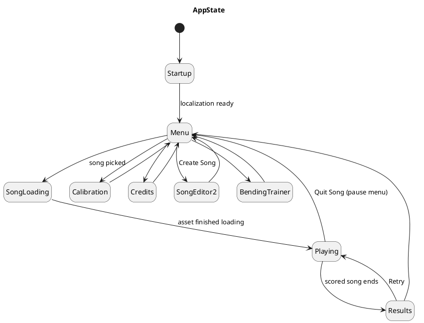
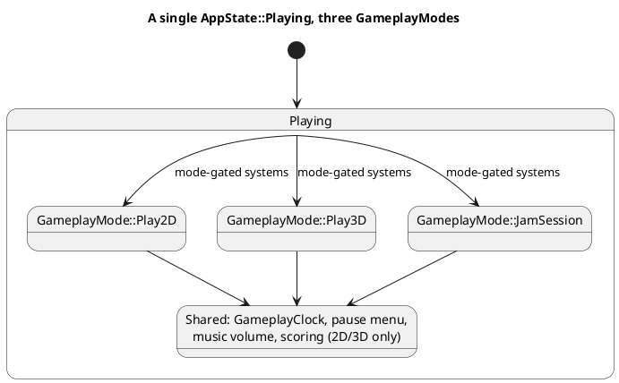
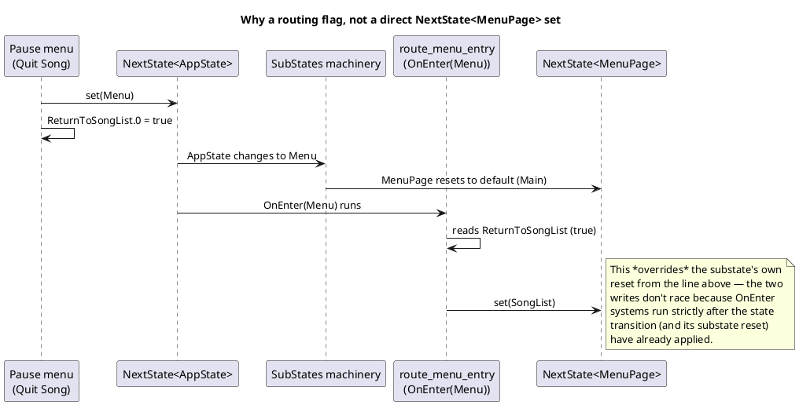

# Application States and Modes

Harmonicon uses Bevy's `States`/`SubStates` machinery to drive which
screen is showing and which set of gameplay systems is active. This
chapter describes the two state machines involved — `AppState` (the
top-level screen) and `GameplayMode` (which of three different gameplay
experiences `AppState::Playing` currently means) — plus `MenuPage`, the
sub-state that only exists while `AppState::Menu` is active, and the
routing-flag pattern used to hand information across a state transition
that the state machinery itself doesn't carry.

## `AppState`: the top-level screen

`AppState` (`src/app.rs`) is a plain Bevy `States` enum:

Each transition triggers Bevy's `OnExit`/`OnEnter` systems for the
states involved — this is the backbone every feature's own setup/
teardown hangs off: `gameplay::plugin` sets up the whole scored-gameplay
schedule `OnEnter(AppState::Playing)` and tears every gameplay entity
down `OnExit(AppState::Playing)` via a shared `GameplayRoot` marker
component (every entity gameplay spawns is tagged with it, so cleanup is
one `Query<Entity, With<GameplayRoot>>` despawn rather than tracking
individual entities); `song_editor` does the same around
`AppState::SongEditor2`.

**`Startup` exists to give localization a real starting point.**
`AppState` defaults to `Startup`, and `main.rs` only transitions to
`Menu` once `localization::localization_ready` is true — otherwise the
very first frame of the menu would render with raw Fluent keys instead
of translated text, because the locale bundles haven't finished loading
yet (see [Localization and Theming](localization-and-theming.md) for why
that load is itself asynchronous).

**`SongLoading` exists because asset loading is asynchronous.**
Picking a song sets `SelectedSong` to a `Handle<SongManifest>` and moves
to `SongLoading`; `check_loading` polls
`AssetServer::is_loaded_with_dependencies` every frame and only advances
to `Playing` once the whole manifest — chart, background image, music,
sibling note-theme assets — has actually finished loading. See
[Chart Format and Asset Loading](chart-and-assets.md) for what "the
whole manifest" includes and why a missing sibling asset needs a
*fallback* rather than becoming a load failure (a hard dependency that
never resolves would otherwise hang the loading screen forever, with no
error to explain why).

## `GameplayMode`: what `Playing` actually means

A single `AppState::Playing` covers three quite different experiences,
selected by the `GameplayMode` resource before entering it:

- `Play2D` — falling notes, one lane per hole.
- `Play3D` — the same scoring, rendered around a rotating 3D harmonica.
- `JamSession` — free play over a 12-bar backing, nothing scored.

All three share the same `AppState::Playing` `OnEnter`/`OnExit` and the
same `GameplayLogic` system set (clock tick, scoring, loop handling —
see [The Gameplay Clock](gameplay-clock.md)), which is precisely *why*
they're one `AppState` value with a mode selector, rather than three
separate `AppState` variants: `AppState::Play2D`, `::Play3D`,
`::JamSession` would each need their own copy of every shared
`OnEnter`/`OnExit`/`run_if(in_state(...))` registration (pause handling,
music volume application, HUD overlays that all three modes share), or
force those registrations to accept a slice of three near-identical
match arms. A `Res<GameplayMode>` read inside a `run_if` closure —
`.run_if(|m: Res<GameplayMode>| *m == GameplayMode::Play2D)` — is the
one line of difference each mode-specific system actually needs.

Jam Session doesn't populate `SongNotes` (nothing is scored there), so
every scoring-adjacent system either no-ops gracefully against an empty
`SongNotes` or is itself gated to `Play2D`/`Play3D` only — see
[The Scoring System](scoring-system.md) for the specific places this
matters.

## `MenuPage`: a sub-state scoped to `Menu`

`MenuPage` (`src/menu/routing.rs`) is a Bevy `SubStates`, declared with
`#[source(AppState = AppState::Menu)]` — it only exists, and only
resets to its default (`Main`), while `AppState` is `Menu`. Every menu
screen (`Play`, `ArtistList`, `SongList`, `ModeSelect`, `Options`,
`Theme`, `Lessons`, `LessonReader`, `JamSessionMenu`, `JamGenerate`,
`HelpAbout`, `About`) is one `MenuPage` value, with its own
`OnEnter`/`OnExit` pair spawning and despawning that page's UI.

## The routing-flag pattern

A recurring, slightly awkward problem: when some other `AppState`
transitions *back* into `Menu`, which `MenuPage` should it land on?
"Wherever it makes sense for where the player just was" — Quit Song
should return to the song list, not the main menu; finishing the
Calibration screen should return to Options, where the player was
adjusting input lag; leaving the Song Editor should return to the Play
page. The obvious-looking approach — the exiting screen just calls
`next_page.set(MenuPage::SongList)` directly — doesn't work: setting
`NextState<MenuPage>` in the same tick as `NextState<AppState>`
loses to `SubStates`' own machinery resetting `MenuPage` to its default
the moment `AppState` actually changes to `Menu`.

The fix is a small resource per destination — `ReturnToSongList`,
`ReturnToOptions`, `ReturnToPlay`, `ReturnToHelpAbout` (`src/app.rs`) —
each a bare `bool`. The exiting screen sets its flag to `true` on every
exit path, and `route_menu_entry` (which runs `OnEnter(AppState::Menu)`,
strictly after `SubStates`' own reset has already happened) reads the
flags and issues the *real* `next_page.set(...)` call, one tick later
than the naive approach would have. `LessonContext` and
`GeneratedJamSession` (an in-flight lesson run, and a procedurally
generated Jam Session with no real song behind it) follow the same
"flag/resource read on arrival, in priority order" pattern for their own
end-of-run routing, and the guided tutorial tour
(`menu::tutorial::TutorialTour`) takes priority over all of them while
it's actively driving the screen — see that module for the full
priority order `route_menu_entry` resolves between a running tour, a
lesson context, a generated jam, and the four `ReturnTo*` flags.

