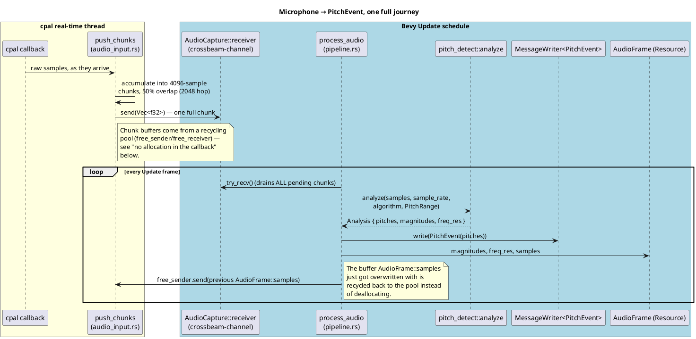

# The Audio Input Pipeline

This is the pipeline that turns "sound coming out of a real harmonica
into a real microphone" into "a `PitchEvent` message an ECS system can
score against a chart." It is the one place in the codebase where
Harmonicon has to cross from a real-time, non-ECS execution context
(a `cpal` audio callback on its own OS thread) back into Bevy's frame
loop, and the design is shaped almost entirely by the constraints that
crossing imposes.

## Why this can't just be "read the mic in a system"

Bevy systems run once per frame, on frame-rate cadence (commonly 60Hz,
i.e. roughly every 16.7ms). A microphone, through `cpal`, delivers audio
on its *own* callback, driven by the OS audio backend's real-time
scheduling — a fundamentally different, higher-priority, and stricter
timing domain. Two things follow from that:

- **The capture callback must never block.** OS audio backends run this
  callback on a real-time-priority thread; anything that can block
  (allocating memory, taking a lock also held by a lower-priority
  thread, doing I/O) risks an audible dropout ("xrun") if it stalls even
  briefly. This constraint shapes essentially every implementation
  detail below.
- **Audio and frame rate aren't the same clock.** The callback fires
  however often the audio backend wants a new buffer, completely
  decoupled from whatever the game's frame rate happens to be. A system
  can't just "read the microphone" the way it reads a `KeyCode` — there
  has to be a hand-off between the two timing domains.

## The pipeline, end to end

### Capture: `audio_system::audio_input`

`start_capture` opens a `cpal::Stream` against the configured (or
system-default) input device and registers `push_chunks` as its data
callback. `push_chunks` accumulates incoming samples into fixed
`CHUNK_SIZE` (4096-sample) buffers with 50% overlap — each chunk shares
its second half with the *next* chunk's first half (`HOP_SIZE = 2048`),
which is standard practice for windowed-FFT pitch detection: it halves
the effective latency between "the reed starts sounding" and "the chunk
containing that onset gets analyzed," at the cost of running the FFT
roughly twice as often for the same audio.

**No allocation in the real-time callback.** A `Vec<f32>` chunk buffer
that would need `malloc` on every hand-off is exactly the kind of
blocking-risk operation the callback can't afford. Instead,
`AudioCapture::free_sender` is a channel the *consumer* side
(`process_audio`, safely inside the Bevy frame loop) uses to hand a
buffer *back* once it's done with it — `push_chunks` drains that channel
first and only allocates a fresh buffer as a fallback if the pool is
ever empty (startup, or the consumer briefly falling behind). In
steady state, the consumer drains far faster than chunks arrive (one FFT
per ~46ms chunk vs. an Update frame roughly every 16.7ms), so the pool
essentially never runs dry.

### Hand-off: `crossbeam-channel`

The callback thread and the Bevy `Update` schedule communicate purely
through a bounded `crossbeam_channel` (`AudioCapture::receiver` /
`free_sender`, both stored on the `AudioCapture` resource) — no shared
mutable state, no locks either side has to reason about, just
send/receive across a well-tested MPSC channel. `process_audio` drains
*every* pending chunk with `while let Ok(...) = receiver.try_recv()`
each frame rather than reading just one — because chunks arrive on their
own real-time cadence, more than one can legitimately land within a
single (slower) Update frame, and dropping the extras would just be
discarding already-captured audio for no reason.

### Analysis: `pitch_detect::analyze`

`analyze` (`audio_system/pitch_detect.rs`) takes one chunk, the sample
rate, the selected `PitchAlgorithm`, and the current `PitchRange`, and
returns an `Analysis`: the detected `Vec<PitchInfo>` plus the FFT
magnitude spectrum and its bin width (`freq_res`) — the same spectrum
data the spectrogram visualizer reuses instead of re-running its own
FFT, since it's already sitting in the published `AudioFrame` resource.

**Five selectable algorithms**, chosen via the `PitchAlgorithm` enum and
switchable live from the Options page:

| Algorithm | Character |
|---|---|
| **FFT** (default) | Peak-picking with harmonic suppression on the FFT spectrum. Can report *multiple* simultaneous pitches — the only algorithm here that can, which matters for chord-tone detection. |
| **YIN** | Cumulative mean-difference function. Monophonic (one pitch), classically robust for a single clean voice/instrument. |
| **pYIN** | Probabilistic YIN — aggregates YIN's own estimate over a Beta-weighted range of candidate lags for a more stable estimate at the cost of more computation. |
| **MPM** | McLeod Pitch Method — normalized square-difference autocorrelation; often the most reliable choice for a single harmonica note (see `docs/lessons_plan.md`/`CLAUDE.md`'s recording-workflow notes, which specifically recommend it for Song Editor Record mode). |
| **NMF** | Non-negative matrix factorization against a dictionary of harmonica note spectra, rebuilt whenever the detection range changes. The one algorithm that's *chart-aware* by construction, since its dictionary is built from exactly the notes the current harp/chart can produce. |

**`PitchRange` is chart-driven, not a fixed global constant.** Detecting
across the full audible spectrum wastes computation and increases false
positives from other pitches a harmonica simply cannot produce (a
different instrument bleeding through the mic, room noise at an
implausible pitch). `PitchRange` (default 200–2500 Hz) is narrowed to
`Harmonica::frequency_range()` — the specific harp's actual playable
range — the moment a song starts, and to the selected key's range in the
Bending Trainer; both reset it to the default on state exit. This is
also why NMF's dictionary staleness check has to include the range as an
input, not just the algorithm choice: a dictionary built for one harp's
notes would silently misclassify pitches from a different one.

### Publishing: `PitchEvent` and `AudioFrame`

Two different things get published from the same `analyze` call,
because they have two different kinds of consumer:

- **`PitchEvent`** (a `Message`) — the *detected pitches*, for anything
  that reacts to "what changed this frame": scoring (`collect_pitches`
  in `gameplay`), the Song Editor's live recording, Jam Session's hole-
  map tinting.
- **`AudioFrame`** (a `Resource`) — the raw FFT magnitude spectrum and
  the just-analyzed sample buffer, for anything that wants continuous
  access to "what does the signal currently look like" rather than a
  discrete event — the spectrogram visualizer being the only consumer
  today.

## Downstream: synthesis and file decode

`audio_system` also owns two pieces that have nothing to do with
*capturing* audio but share its "audio infrastructure, not a feature"
status:

- **`synth.rs`** — an additive harmonica-voice synthesizer
  (`render_pcm`, operating on a `Vec<PhraseNote>` tick/frequency list)
  used everywhere Harmonicon needs to *produce* a harmonica-like sound
  rather than detect one: the Song Editor's Play/Practice/Record preview
  and note-audition blip, `gameplay::call_response`'s one-shot "call"
  demo audio, and — the newest consumer — per-track MIDI backing stems
  for Jam Session (see [Jam Session](jam-session-architecture.md)).
  Vibrato/FM modulation here integrates frequency over *time* (a phase
  accumulator), never `modulated_freq × t` directly — the latter drifts
  pitch upward over the duration of a held note, a subtle bug that's
  easy to reintroduce if this synth is ever touched without knowing why
  the phase-accumulator form was chosen.
- **`waveform.rs`/`wav.rs`** — OGG/WAV peak-amplitude pre-analysis (via
  `rodio`, decode-only) and WAV encode, used at asset-load time to give
  the song-progress bar a waveform to draw immediately rather than
  decoding audio on the main thread mid-setup, and to turn synthesized
  PCM back into a playable `AudioSource` (the generated Jam Session bass
  line, MIDI-track backing stems, MIDI-import backing tracks).

Neither of these touches `cpal` or the real-time callback at all — they
run as ordinary (if sometimes CPU-heavy) synchronous code, either inside
a custom `AssetLoader` (see [Chart Format and Asset Loading](
chart-and-assets.md)) or inside an ordinary system, and carry none of
the real-time constraints the capture side does.
