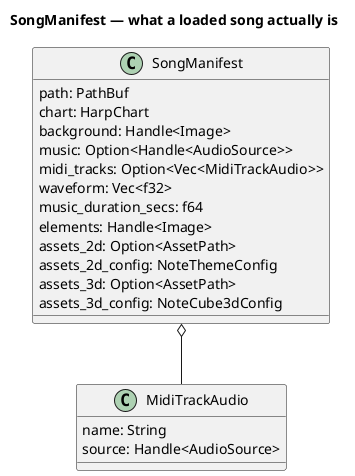
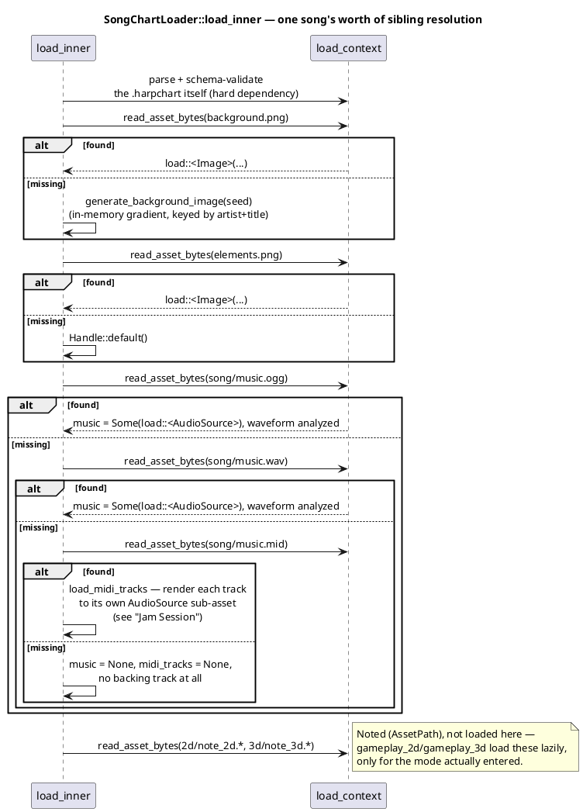

# Chart Format and Asset Loading

A "song" in Harmonicon is more than a chart file — it's a chart plus a
loose bundle of optional sibling assets (music, art, per-song note
themes), all pulled together into one loaded `SongManifest` by a custom
Bevy `AssetLoader`. This chapter covers the on-disk chart format, the
loader that turns a folder into a `SongManifest`, and the specific
design pattern — checking a sibling's existence before making it a hard
dependency — that lets a song ship with almost nothing beyond its chart
and still load correctly.

## The chart format: `.harpchart`

A chart is a JSON file (`song::chart::HarpChart`), validated at load
time against `assets/song_schema.dtd.json` via the `jsonschema` crate.
Its top-level shape:

- **`metadata`** — including `format_version`, checked (not just
  descriptive) against `song::chart::CURRENT_FORMAT_VERSION`; a chart
  declaring a *newer* version than the running build understands is
  rejected with a clear "this chart needs a newer Harmonicon" message
  rather than failing confusingly downstream against a schema it wasn't
  written for.
- **`song`** — title, artist, tempo, key, time signature.
- **`harmonica`** — diatonic or chromatic, hole layout, tuning/bending
  profile, and (see the Song Editor and Jam Session chapters) the
  reference `scale` used for out-of-scale coloring.
- **`timing`** — `resolution` (ticks per quarter note) and a
  `tempo_map` (a sorted list of `(tick, bpm)` points) — see
  [The Song Editor](song-editor-architecture.md) for why this is a real,
  chart-declared value rather than a hardcoded constant, and how that
  choice paid off when the Song Editor's own tick resolution later
  changed.
- **`track`** — the timed list of notes: each item has a `time` (or
  `tick`, resolved against the tempo map) and one or more note `events`
  (hole + blow/draw + expected pitch), optionally carrying technique
  `modifiers` (bend, overblow, overdraw, slide, vibrato, wah-wah).

**Schema strictness is deliberate, and has a real consequence for
schema evolution.** Every level of the schema sets
`additionalProperties: false`, so *removing* a field from the schema
would break previously-authored charts still carrying it at validation
time (a plain `serde` struct would just silently ignore an unknown
field; the schema validator won't). Field removals in this codebase
either keep the old key present-but-ignored in the schema, or accept the
break explicitly and bump `format_version` — there's no silent middle
ground.

## `SongManifest`: the loaded, in-memory result

`SongManifest` is itself a Bevy `Asset`, registered with
`app.init_asset::<SongManifest>().register_asset_loader(SongChartLoader)`
(`song::SongPlugin`). Picking a song sets `SelectedSong(Handle<
SongManifest>)` and moves `AppState` to `SongLoading`;
`menu::routing::check_loading` polls `AssetServer::
is_loaded_with_dependencies` every frame and only advances to `Playing`
once the *whole* manifest — chart plus every asset it depends on — has
resolved (see [Application States and Modes](app-states.md)).

## `SongChartLoader`: the custom `AssetLoader`

`song::loader::SongChartLoader` (`type Asset = SongManifest`) is an
async `AssetLoader` — it runs as a future on the `AssetServer`'s IO task
pool, off the main thread, alongside every other asset load in the
game. Its job is considerably more involved than "parse the JSON,"
because **every sibling asset a song folder can ship is optional except
the chart itself**:

**The load-order subtlety that makes all of this work**: every sibling
is checked for existence with `read_asset_bytes` *before* it's ever
handed to `load_context.load()`. Calling `load()` registers that path as
a **hard dependency** of the `SongManifest` asset — and a dependency
pointing at a file that doesn't exist never resolves, so
`AssetServer::is_loaded_with_dependencies` (the very check
`check_loading` polls) would wait on it forever. Without the
existence check first, a song shipping only a chart wouldn't fail
loudly — it would just hang on the loading screen indefinitely, with no
error message pointing at why. `Example Song 3` in the bundled assets
exists specifically to exercise this path: it ships *only* a chart, on
purpose, so this fallback behavior stays covered by
`tests/asset_layout.rs` rather than silently regressing.

**2D/3D note assets are noted, not loaded, here.** `assets_2d`/
`assets_3d` are stored as an `AssetPath`, not a `Handle` — loading them
here would make them a manifest dependency kept resident for the
*entire* song regardless of which render mode (if either) actually gets
entered. `gameplay_2d::setup`/`gameplay_3d::setup` load the matching one
on demand, and free it again on exit.

## Why the asset source matters: bundled vs. external

Every sibling read above goes through `load_context`, which resolves
relative to whichever `AssetSource` the manifest itself was loaded
from — the default (bundled `assets/`) or `external://` (the
`~/Harmonicon` drop-in folder registered in `main.rs`, see
[The Plugin Architecture](plugin-architecture.md)). The loader captures
this explicitly (`load_context.path().source().clone_owned()`) and
threads it through every sibling path it builds, rather than ever using
a bare `PathBuf`/`&str` — a bare path always resolves against the
*default* source, so without this, a song loaded from `external://...`
would have its own chart parsed correctly but its music/images silently
looked up in the bundled tree instead. The one deliberate exception:
the fallback note-theme JSON (`notes/2d/circular.json`) is loaded with a
bare, source-less path on purpose — a shared default asset lives in the
bundled tree regardless of where the *song* itself came from.

## MIDI as a chart source: two very different roles

`midly`-based MIDI parsing appears in two places in the codebase with
deliberately different responsibilities, both built on the same
low-level, pure parsing module (`song::midi` — track names, tempo maps,
note on/off pairing, no pitch-to-harp resolution or chart-building logic
at all):

- **Authoring**: `song_editor::midi_import` reads a MIDI file the player
  picks in the Song Editor, resolves its pitches onto the currently
  selected harp, and drops the result onto the note grid as ordinary,
  editable chart notes — a one-time, offline conversion. See
  [The Song Editor](song-editor-architecture.md).
- **Runtime backing**: `song::loader`'s `song/music.mid` fallback (this
  chapter) keeps a MIDI file's tracks *separate* rather than converting
  them to chart notes at all, rendering each to its own playable audio
  stem via the shared additive synth. See
  [Jam Session](jam-session-architecture.md) for how those stems become
  independently mutable playback.

Both share `song::midi`'s parsing primitives, but neither depends on the
other — one produces chart *notes*, the other produces chart *audio*,
and `song::midi` itself stays agnostic of which a given caller is doing.
