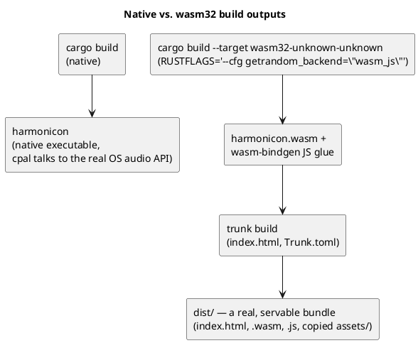
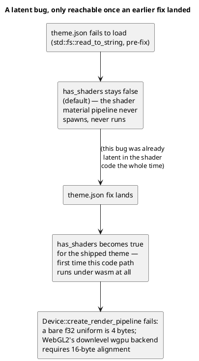

# Native vs. WebAssembly

Harmonicon's primary target is a native desktop build, but the crate
also compiles for `wasm32-unknown-unknown` and boots and runs in a real
browser, verified with headless Chromium. This chapter is the
consolidated picture of what that involved: the build pipeline itself,
the dependency conflicts that had to be resolved to compile at all, the
asset-loading rework [Localization and Theming](
localization-and-theming.md) and [Chart Format and Asset Loading](
chart-and-assets.md) cover in depth from their own angles, a genuine
GPU-shader compatibility bug the wasm push surfaced, and — importantly —
an honest list of what still doesn't work in a browser.

## The build pipeline

`Trunk` (a Rust/Bevy-ecosystem-standard wasm bundler) drives the wasm
build from `index.html` and `Trunk.toml` at the repository root — it
compiles the crate for `wasm32-unknown-unknown`, runs `wasm-bindgen` to
generate the JS glue, and copies `assets/` alongside the output. The
`<canvas id="bevy-canvas">` element `index.html` declares is wired up in
`main.rs`'s `WindowPlugin` (`canvas: Some("#bevy-canvas".into())`,
`fit_canvas_to_parent: true`, `prevent_default_event_handling: true`) —
all three fields are documented no-ops on native, so no `#[cfg]` is
needed around setting them unconditionally.

## Getting it to compile at all: two dependency conflicts

Two unrelated dependency issues blocked a `wasm32` build before any
actual feature work could begin, both worth knowing about since they'll
resurface if a dependency bump reintroduces either:

- **Two incompatible major versions of `getrandom` in the tree at
  once** — 0.4.x (pulled in via `rand`/Bevy) and 0.3.x (via `ahash`) —
  and *both* refuse to target `wasm32` without an explicit opt-in.
  `Cargo.toml`'s `[target.'cfg(target_arch = "wasm32")'.dependencies]`
  section enables both explicitly (the 0.3.x line under a renamed
  package alias, `getrandom03`, since both can't share the plain
  `getrandom` name in one `Cargo.toml`), and the 0.3.x line additionally
  needs a compile-time `--cfg` the Cargo feature alone doesn't cover —
  hence the `RUSTFLAGS='--cfg getrandom_backend="wasm_js"'` in every wasm
  build/check command. This isn't set globally in `.cargo/config.toml`
  because that file is this repository's per-machine, gitignored local
  build config (linker overrides, `sccache`), not somewhere to route a
  project-wide setting through.
- **`jsonschema`'s default features pull in `reqwest`**, which
  explicitly refuses to compile for `wasm32` at all
  (`resolve-http`/`resolve-file`, used for resolving a schema's remote
  `$ref`s — a capability nothing in this codebase's schema validation
  actually uses, confirmed before disabling). `jsonschema = { version =
  "0.28", default-features = false }` fixes this with no behavior change
  on native either, verified by the full native test suite still
  passing unchanged.

## The asset-loading rework

Covered in depth in their own chapters — this is the index:

- [Localization and Theming](localization-and-theming.md): the
  `bevy_fluent` startup panic (`load_folder` needing directory listing),
  fixed with a fixed `LOCALES` list loaded by explicit path; and
  `theme::load_theme`'s raw `std::fs::read_to_string`, fixed by turning
  `ThemeJson` into a real `AssetServer`-loaded `Asset`.
- [Chart Format and Asset Loading](chart-and-assets.md) /
  [Persistence](persistence.md): `assets_management`'s song/theme/
  harmonica-model discovery, fixed with a `#[cfg]`-gated pair — native
  keeps its real `std::fs::read_dir` scan unchanged, wasm reads a
  `build.rs`-generated manifest instead (built at *build* time, on the
  native host, regardless of the crate's own `--target`).

## A genuine bug the wasm push surfaced: WebGL2 uniform alignment

Not every issue wasm exposed was a directory-listing problem. Once
theme loading actually started working under wasm (rather than failing
silently before that fix landed), the game reached, for the first time,
a code path that actually *used* a custom WGSL shader material — the
themed buttons' animated smoke-shader background — and immediately hit
a real GPU pipeline-creation error:

Desktop/native rendering backends tolerate a smaller-than-16-byte
uniform buffer binding just fine; WebGL2's `wgpu` "downlevel" backend
(used when a browser doesn't expose WebGPU, still the common case) does
not, and this shader's `time: f32` uniform was 4 bytes. This wasn't a
new bug introduced by the wasm work — it was **always broken for any
browser without WebGPU**, just never *discovered*, because the earlier
theme-loading failure had been silently preventing this code path from
ever running under wasm at all. This is worth internalizing as a general
lesson about cross-platform testing: fixing one bug can be exactly what
it takes to reveal the next one behind it, and "it worked when I tested
wasm" can mean "the feature I was testing never actually ran," not
"the feature works." The project's own resolution was to remove the
smoke-shader button effect entirely rather than pad the uniform to
16 bytes and keep it — a legitimate call given the effect's actual
value versus the ongoing WebGL2-compatibility maintenance burden of
every future shader touching this material.

## What still doesn't work in a browser

Verified via headless Chromium (checked for zero panics across a full
run): WGPU initializes, localization loads, mic capture fails
*gracefully* exactly like a real permission-less browser would
(`MicStatus::Failed`, no panic — cpal simply has nothing to talk to
under wasm), and bundled songs/themes/note-themes/harmonica-models all
load correctly. What's explicitly still missing, none of which have a
drop-in browser equivalent to reach for:

- **Actual microphone input.** The whole point of the game — cpal has
  no wasm backend; a real implementation needs a Web Audio API bridge
  (`AudioContext`/`MediaStreamAudioSourceNode`, called through
  `wasm-bindgen`/`web-sys`), feeding the same `pitch_detect::analyze`
  pipeline [The Audio Input Pipeline](audio-pipeline.md) describes —
  the pipeline's *analysis* side needs no change at all, only the
  capture side needs a second implementation.
- **Settings and profile persistence.** `figment`/`dirs`-based JSON
  files have no meaning in a browser sandbox; a wasm build would need
  something like `localStorage` or IndexedDB instead — see
  [Persistence](persistence.md).
- **The `~/Harmonicon` external-folder watcher.** No home directory
  concept in a browser at all — the native code already handles
  `dirs::home_dir()` returning `None` gracefully (no external songs/
  themes/lessons, no watcher started), so nothing wasm-specific was
  needed to avoid a crash here; a real wasm equivalent (letting a player
  add their own content some other way — a file picker, drag-and-drop
  into the page) is unexplored.

Each of these three is a real, standalone piece of engineering — not a
loading-order fix like the ones this chapter otherwise covers — and
each would benefit from its own design discussion before being started,
per this project's own working practice of not guessing at scope for a
large, undesigned subsystem.
