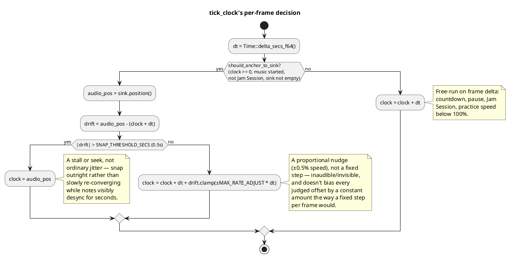
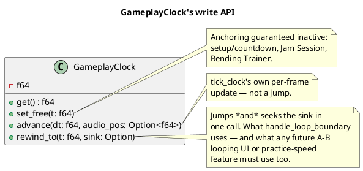
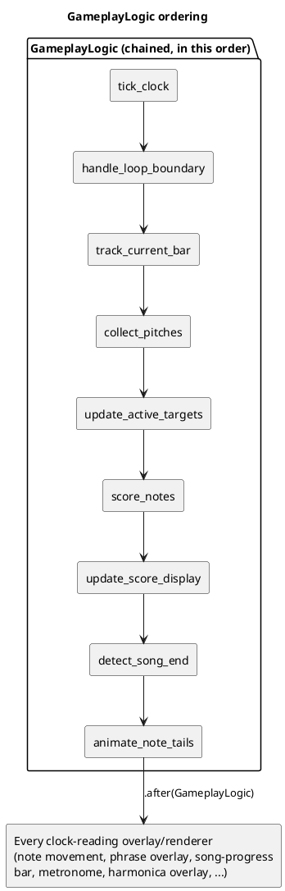

# The Gameplay Clock

Every timing-sensitive system in scored gameplay — where a falling note
currently is, whether it's inside its hit window, what the HUD displays,
where the phrase/song-progress overlays are drawn — reads its notion of
"now" from exactly one place: `GameplayClock` (`gameplay/clock.rs`).
This chapter explains what that clock actually is, why it isn't simply
"the real-time elapsed since the song started," and the API design that
makes its one hard invariant difficult to violate by accident.

## Why not just use real elapsed time?

The naive approach — track `Instant::now() - song_start` and treat that
as the authoritative song position — breaks the moment the *audio*
itself doesn't advance in perfect lock-step with wall-clock time. In
practice it never does: audio decoders have startup latency, backends
occasionally hitch, and a `bevy_audio`/`rodio` sink's own reported
playback position is the one source of truth for "where is the actual
sound the player is hearing right now." A note judged against
wall-clock time while the *audio* is a few milliseconds ahead or behind
reads as mistimed even when the player's timing was perfect — the
judgment is comparing the player against the wrong reference.

So `GameplayClock` doesn't track wall-clock time directly; once music
starts, it tracks the **audio sink's own position**, with wall-clock
delta as a fallback for the periods where there's no sink to anchor to
at all (the pre-song countdown, Jam Session, before the sink has
produced its first position report).

## The anchoring algorithm

Two constants make this concrete: `MAX_RATE_ADJUST` (0.5%) caps how much
the clock's *rate* — not a one-off jump — can deviate from real time
while gently correcting toward the sink, expressed as a rate rather than
a fixed per-frame step specifically so the correction doesn't bias every
judged hit offset by a constant amount for as long as it's active, and
so it doesn't over- or under-correct depending on the actual frame rate.
`SNAP_THRESHOLD_SECS` (0.5s) is the line between "ordinary jitter, worth
correcting gently" and "a real discontinuity" (a decoder stall, a
backend seek) that should be corrected immediately rather than converged
toward over several seconds of visibly-desynced notes.

**Jam Session deliberately never anchors.** There's no long, fixed-length
track to drift against in free play — Jam Session's music is either a
generated backing loop or a picked song played on repeat, and nothing
about that experience benefits from the sink-anchoring machinery.
`should_anchor_to_sink` excludes `GameplayMode::JamSession` explicitly.

## The encapsulation: why the inner value is private

`GameplayClock`'s inner `f64` is a private tuple field. The type exposes
exactly three ways to change it, and each one documents (or, for the
anchored case, actively enforces) the invariant that matters:

The invariant all three exist to protect: **anything that jumps the
clock must also seek the music sink, or suspend anchoring** — because if
it doesn't, the very next `tick_clock` pass sees the sink still sitting
at its old position, computes a large "drift," and drags the clock right
back toward where it just jumped *from*. This is a genuinely easy bug to
write by hand (assign the new time, forget the sink is now stale) and a
confusing one to debug (the symptom is "my rewind gets silently undone
one frame later," with no error or panic pointing at why) — which is
exactly the shape of bug a private field plus a small, invariant-carrying
API is good at ruling out at the type level rather than relying on every
future caller remembering a rule from a comment.

`rewind_to` is the one both existing callers that jump the clock already
use — `handle_loop_boundary` (an A–B loop or a chart's own `loop`
section reaching its end point) is the only one in the codebase today,
but the doc comment above is explicit that this is also the contract any
future practice-speed-change or manual seek feature must follow, not an
incidental detail of the current feature set.

## Reading the clock: the ordering invariant

The other half of the contract, enforced by convention rather than the
type system: **every system that *reads* the clock must be ordered
`.after(GameplayLogic)`** (the `SystemSet` that ticks it — see
[The Plugin Architecture](plugin-architecture.md)). Bevy's scheduler is
free to run unordered systems in any relative sequence, including
parallelized; a clock-reading system that isn't explicitly ordered after
the tick can read last frame's value on some frames and this frame's on
others, which manifests as visible note-movement stutter rather than a
crash — the kind of bug that's easy to introduce and easy to miss in
testing if it only shows up as an occasional single-frame jitter.

## Practice speed and pausing

Two more free-running cases fall out of the same `should_anchor_to_sink`
predicate rather than needing special-case code: **practice speed below
100%** (real time-stretched audio isn't implemented, so the sink is
simply paused and the clock free-runs on `Time::delta` scaled by the
practice-speed factor instead — returning to 100% re-seeks the sink to
the clock's current position via `rewind_to` before resuming it, since
the sink sat still the whole time the clock kept moving), and **the
wait-for-note freeze** (`wait_freeze_overlay` — the chart holds at the
next unjudged note until the player plays it; `tick_clock` pauses the
sink and skips advancing the clock at all while a note is "due" under
that mode, and Jam Session never populates `SongNotes`, so the freeze
condition is always trivially false there regardless).
