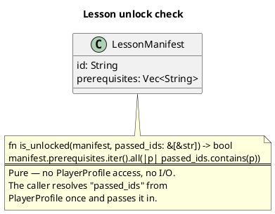
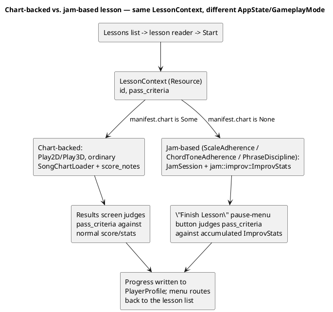

# The Lessons Engine

The Lessons module (`src/lessons/`) is Harmonicon's guided curriculum: a
tree of prerequisite-gated lessons, each judged by one of a small,
closed set of pass criteria, with progress persisted per player. This
chapter covers the manifest format, how a lesson actually *runs*
(mostly by reusing the ordinary gameplay pipeline, with one deliberate
exception), and how discovery works for both bundled and player-dropped
lesson content.

## `LessonManifest`: the authored content

A lesson is a `lesson.json` file (`assets/lessons/<unit>/<lesson>/`,
schema-validated against `assets/lesson_schema.dtd.json`), with a stable
`id` (referenced by other lessons' `prerequisites` and by
`PlayerProfile`'s progress records — ids are never meant to change once
published) and:

- **`title_key`/`body_key`** — Fluent message *keys*, never raw display
  text. This is a hard rule, not a style preference: it's what lets a
  lesson's text be properly localized, and it means the Song Editor's
  own lesson-authoring UI (see [The Song Editor](
  song-editor-architecture.md)) can never accidentally write real
  display text into the manifest — `serialize_lesson` derives the keys
  from the lesson id and prints the key/text pairs to add by hand to the
  locale files, the same manual step every bundled lesson's authoring
  already requires.
- **`chart`** — optional. Present for a lesson backed by an ordinary
  `.harpchart` (played through the *unmodified* gameplay pipeline — see
  below); absent for the handful of open-ended, jam-based lessons.
- **`prerequisites`** — a list of other lesson ids that must be passed
  first.
- **`pass_criteria`** — a small closed enum (not open-ended scripting):
  `Accuracy { threshold }`, `Technique { technique, threshold }`, or one
  of three jam-based criteria (`ScaleAdherence`, `ChordToneAdherence`,
  `PhraseDiscipline`) for open improvisation lessons with no fixed notes
  to score.

## Prerequisite gating is a pure function

`is_unlocked` takes the manifest and an already-resolved list of passed
lesson ids — it doesn't reach into `PlayerProfile` itself. This keeps it
trivially unit-testable against plain data (see
[Testing Strategy](testing-strategy.md)) and, more importantly, keeps
`lessons::manifest` ignorant of how progress is actually stored — the
same "low-level module doesn't depend on the higher-level thing that
uses it" direction this codebase applies consistently (see
[Module Boundaries and Dependency Rules](module-dependency-rules.md)).

## Running a lesson: mostly the ordinary pipeline, with one exception

**A chart-backed lesson plays through the exact same pipeline as an
ordinary song** — `Play2D`/`Play3D`, the same `SongChartLoader`, the
same `score_notes`. There is no lesson-specific scoring path. What
changes is layered on top, via a `LessonContext` resource kept in flight
for the run's duration: the results screen judges `pass_criteria`
against it instead of (or alongside) recording an ordinary song-best,
adaptive difficulty is forced off (a lesson's own pacing shouldn't be
further modulated by a second, unrelated pacing system — see
[Application States and Modes](app-states.md) for the general
routing-flag pattern `LessonContext` follows for "where do I land when
this run ends"), and the menu routes back to the lesson list rather than
the song list on exit.

**The one exception**: `PassCriteria::ScaleAdherence`/
`ChordToneAdherence`/`PhraseDiscipline` have no chart notes to score at
all — they're an open `GameplayMode::JamSession` run judged on live
adherence data `jam::improv::ImprovStats` was already accumulating
continuously (see [Jam Session](jam-session-architecture.md)), with a
dedicated "Finish Lesson" pause-menu button (visible only when a
`LessonContext` is in flight during a jam) that judges the accumulated
stats on demand, since there's no natural chart end to trigger judging
automatically the way a scored song has.

## Discovery: bundled plus external, kept live

`lessons::catalog::scan_all_lessons` scans `assets/lessons` and then, if
present, `~/Harmonicon/lessons` — bundled entries first, so a
player-dropped lesson can never silently reorder or shadow shipped
curriculum. This mirrors `assets_management`'s own bundled-plus-external
pattern for songs and themes exactly (see [Persistence](persistence.md)
for the shared live-filesystem-watcher infrastructure both ride on) —
deliberately: `lessons` depends on `assets_management` for the low-level
watch machinery, never the other way around, since `assets_management`
is generic shared vocabulary that has no business knowing what a
"lesson" is. A live drop-in under `~/Harmonicon/lessons` fires a
`LessonsRescanned` message the Lessons list page consumes to rebuild
itself if it happens to already be open — no restart, no manual refresh
button.

## Progress

`lessons::progress` judges a finished run (`Accuracy`/`Technique`
thresholds against `results::accuracy`/`SongStats`; the jam-based
criteria against `ImprovStats`) and the result is written into
`PlayerProfile` (see [Persistence](persistence.md)) as a passed/not-yet-
passed record keyed by lesson id — the same profile file per-song best
scores and Bending Trainer drill records already live in, not a separate
lessons-specific save file.
