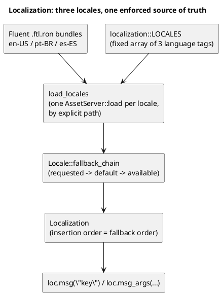
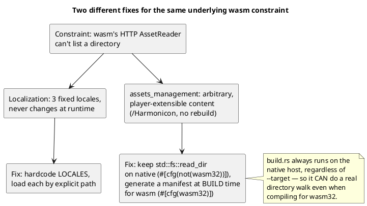
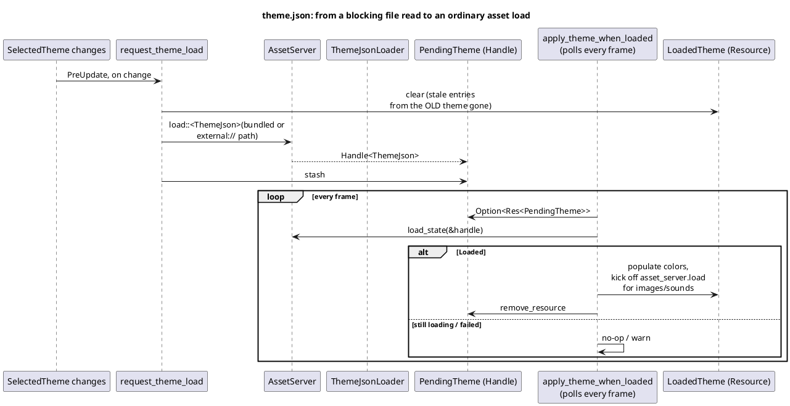

# Localization and Theming

Localization and theming are two separate subsystems (`localization.rs`
and `theme.rs`), but they're covered in one chapter because they share
both a common shape — data loaded from files, resolved against a
player preference, applied reactively when that preference changes —
and a common history: both were reworked during the same push to get
Harmonicon running under WebAssembly, for the same underlying reason
(a wasm `AssetReader` fetches over HTTP and simply cannot list a
directory the way a native filesystem can), which makes them a useful
paired case study in *why* an asset-loading design choice that works
fine natively can quietly fail to generalize to a second target platform.

## Localization: enforcement, then loading

**Every user-visible string must come from `loc.msg("key")` (or
`loc.msg_args` for one with interpolated values), never a raw string
literal.** This isn't a style guideline enforced by review discipline —
it's enforced by the build itself. `build.rs` statically scans every
source file for a handful of known "sink" shapes a raw string could
reach the screen through (`Text::new("...")`, a `bsn!` `Text({"..."})`
binding, a handful of shared label-spawning helpers) and fails the build
if it finds a literal that looks like natural-language text (a simple
two-feature heuristic: contains an ASCII letter *and* whitespace — this
deliberately doesn't flag a single word like `"Retry"`, which is a much
larger, separate content-migration effort). A `LocalizedStr` newtype
wraps every already-localized string so a value that's passed *through*
several layers before display still carries the "this came from
`loc.msg`" guarantee with it.

**Why loading is a fixed list, not a directory scan.** The natural way
to load "every locale we ship" would be `AssetServer::load_folder
("locales")` — but that needs the asset reader to *list* the directory's
contents, which `bevy_asset::io::wasm::HttpWasmAssetReader` cannot do
over plain HTTP. This used to hard-panic the game on startup under wasm
(`bevy_fluent`'s bundle builder indexing an empty map, since
`load_folder` silently found nothing). The fix: `localization::LOCALES`
is a fixed, three-element array of language tags, each loaded by an
*explicit* path (`locales/<lang>/main.ftl.ron`) — no directory listing
involved at all, so it works identically on native and wasm. A unit
test, `locales_const_matches_the_assets_directory`, keeps the constant
honest against what's actually on disk (using a real
`std::fs::read_dir` — safe there specifically because *tests* always
run on the native host, never inside the wasm build itself).

This "fixed list instead of a directory scan" fix generalizes cleanly
*here* because the set of shipped locales is genuinely small and
rarely-changing — which is exactly the assumption that stops working
for the next section.

## Theming: names via a build-time manifest, content via a real `Asset`

Themes have the same directory-listing problem localization did, but a
critically different shape: while there are only three fixed locales, a
player can drop an arbitrary number of new songs, themes, and harmonica
models into `~/Harmonicon` on native **without a rebuild** — so
`assets_management`'s song/theme/note-theme/harmonica-model discovery
*cannot* become a fixed compile-time list the way `LOCALES` did, without
breaking that entirely. This is the one place the localization fix's own
pattern had to be rejected, deliberately, rather than reused:

`assets_management`'s scan functions (`scan_all_songs`,
`scan_note_themes`, `scan_harmonica_models`, `scan_ui_themes`) are each
two `#[cfg]`-gated implementations under the same name: the original
`std::fs::read_dir`-based body, completely unchanged, behind
`#[cfg(not(target_arch = "wasm32"))]`; and a `#[cfg(target_arch =
"wasm32")]` sibling that reads a manifest `build.rs` generated at
*build* time instead (`generate_wasm_asset_manifest`, included via
`include!(concat!(env!("OUT_DIR"), "/asset_manifest.rs"))`). The insight
this rests on: **a build script always compiles for, and runs on, the
native host**, no matter what `--target` the crate itself is being
built for — so `build.rs` can do a completely ordinary
`std::fs::read_dir` walk of `assets/` even while producing a `wasm32`
binary, mirroring each scan function's own discovery rule exactly (the
first `*.harpchart` under a song's `song/` subfolder, and so on) so the
two implementations can't silently drift apart. Native behavior is
*exactly* unchanged — a player can still drop a new song into
`~/Harmonicon/songs/` and see it without a rebuild — because the
`#[cfg(not(wasm32))]` body never went away; only wasm, which has no
concept of "drop a file into a folder on the machine running the
browser" in the first place, gets the build-time-baked alternative.

**Theme *content*, not just theme *names*, has a second, distinct
loading problem.** Even once `AvailableThemes` correctly lists theme
names under wasm, actually applying a theme still needs to read that
theme's `theme.json` — and the original `theme::load_theme` did that
with a raw `std::fs::read_to_string`, which fails identically under
wasm (a different mechanism than a directory listing: an actual file
read, not an enumeration). The fix here mirrors the *chart* loading
pipeline described in [Chart Format and Asset Loading](
chart-and-assets.md) rather than the manifest trick above: `ThemeJson`
is now a real Bevy `Asset`, loaded through a small custom `AssetLoader`
(`ThemeJsonLoader`, matching `song::loader::SongChartLoader`'s shape —
registered by the compound extension `"theme.json"`, not the bare
`"json"`, so it can never collide with some other JSON asset gaining its
own loader later) — which works identically on native and wasm because
`AssetServer` itself already abstracts over "read this file," the same
way it already did for a theme's sibling images and sounds.

This changed `load_theme` from one synchronous function into two
systems — `request_theme_load` (kicks off the load, clears the previous
theme's data immediately) and `apply_theme_when_loaded` (polls the
handle every frame, a no-op whenever nothing is pending, and populates
`LoadedTheme` once the load resolves) — because an `AssetServer` load is
inherently asynchronous; there's no synchronous "just get me the bytes"
escape hatch that would also work under wasm.

## The shared lesson

Both fixes are instances of the same underlying principle, applied
differently based on one question: **does this data need to change at
runtime without a rebuild?** Where the answer is no (three fixed
locales), bake it in at build time and load by explicit path. Where the
answer is yes but only on native (arbitrary player-dropped content),
keep the real runtime scan on native and bake in a build-time-computed
equivalent for wasm specifically, leaving native completely untouched.
Where the thing being loaded is genuine file *content*, not just a
*listing* of what exists, route it through `AssetServer` like any other
asset rather than reaching for `std::fs` directly — `AssetServer` was
already built to abstract over exactly this platform difference, for
every asset type that goes through it correctly. See
[Native vs. WebAssembly](cross-platform-wasm.md) for the fuller picture
of what's ported to wasm today and what remains (mic capture, settings/
profile persistence, the external-folder watcher).
