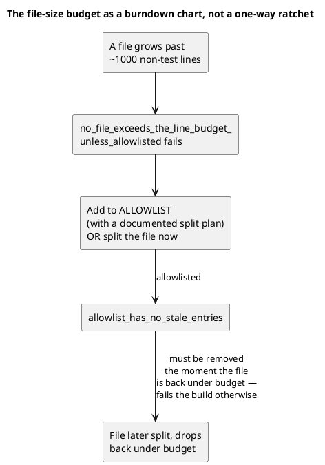
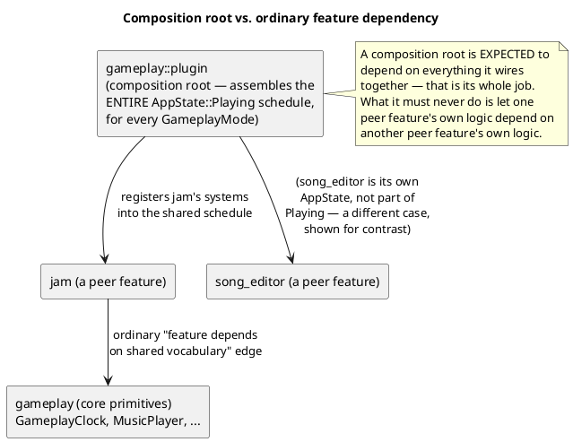

# Module Boundaries and Dependency Rules

Harmonicon has no Cargo-workspace boundaries between its subsystems (see
[System Overview](overview.md) for why it's one library crate) — which
means nothing at the compiler level stops any module from importing any
other. The structure this chapter describes is enforced by a mix of one
automated test, and — for everything the test can't check — reviewer
discipline against a written-down rule. This chapter states the rules,
the one place they're mechanically checked, and a documented exception
worth understanding rather than working around.

## Rule 1: unrelated things do not share a file

A file is one concern; its name says what that concern is; landing on a
file via a grep hit should mean everything in it is relevant to what you
were looking for. This is checked mechanically:
`tests/physical_design.rs::no_file_exceeds_the_line_budget_unless_
allowlisted` enforces a ~1000-line budget on non-test code per file (test
modules — `#[cfg(test)] mod tests { ... }` or a sibling `tests.rs` — are
excluded from the count, and files literally named `tests.rs` are
skipped as pure test content with no budget of their own).

The allowlist isn't an escape hatch that quietly accumulates forever —
a second test, `allowlist_has_no_stale_entries`, fails the build if an
allowlisted file has already dropped back under budget, which is what
makes the list function as an honest burndown chart of known,
intentional debt rather than a ratchet that only ever grows. New code
isn't allowed to add itself to the list preemptively — the rule this
enforces is "split before adding to an already-large file," not "budget
permission in advance."

This rule has real teeth: a 2026-07 pass (`docs/physical_design_plan.md`)
measured `gameplay/mod.rs` at 2,921 lines mixing plugin wiring, ~30
resource/component/message types, the score-state model, a 250-line
scoring system, HUD updates, and 1,250 lines of inline tests (43% of the
file) — and split it into the `gameplay/` module structure described in
[The Scoring System](scoring-system.md) and [The Gameplay Clock](
gameplay-clock.md) today. The Song Editor's own `snap.rs` (see
[The Song Editor](song-editor-architecture.md)) was split out of
`state.rs` for exactly this reason, as recently as the same session that
built the feature living in it — this isn't a one-time historical
cleanup, it's an ongoing discipline applied as code is written.

## Rule 2: folders match modules, and dependencies point downward

A module's physical location should reflect its level: low-level shared
vocabulary at the bottom, features in the middle, app-wiring at the top
— and nothing should import *upward*. [System Overview](overview.md)'s
package diagram shows the intended shape; this section covers what
"pointing the wrong way" actually looked like before it was fixed, as a
concrete illustration of the rule rather than an abstract statement of
it.

**`AppState` used to live inside `menu`.** Conceptually, an app-wide
state machine is vocabulary every feature shares, not a menu concern —
but historically it lived in `menu/mod.rs`, so `gameplay` (seven
files), `song_editor`, `spectrogram`, and `profile` all had to
`use crate::menu::...` to reach it, even though ten of the eleven things
they were actually importing from there (`AppState`, `GameplayMode`,
`SelectedSong`, `ReturnToSongList`) had nothing to do with menus at all.
Anyone asking "what depends on the menu?" got a misleading answer, and
any review of menu code pulled in readers who only ever wanted the
state enum. The fix was mechanical once diagnosed: this vocabulary now
lives in `app.rs` at the crate's top level (see
[Application States and Modes](app-states.md)), which every feature —
`menu` included — depends on downward, and nothing depends on upward.

**`gameplay::call_response` used to import `song_editor::playback`**
directly for its synth — two peer features welded sideways, when the
synth (`audio_system::synth`, see
[The Audio Input Pipeline](audio-pipeline.md)) is shared audio
infrastructure with no real business living inside an editor tool.
Moving the synth down to `audio_system` — vocabulary both `gameplay`
and `song_editor` can depend on independently — removed the sideways
edge entirely, rather than leaving one feature depending on the other's
internals.

## The documented exception: composition roots

One place in the codebase looks, at first glance, like it violates
"dependencies point downward" — and is worth naming explicitly as a
deliberate, understood exception rather than either hiding it or
mistaking it for a bug to fix:

`gameplay::plugin` — the one file responsible for assembling the entire
`AppState::Playing` system schedule, across all three `GameplayMode`
values — imports from `jam` to register Jam-Session-specific systems
into that shared schedule. Read naively, that's `gameplay` depending on
`jam`, while [Jam Session](jam-session-architecture.md) also describes
`jam`'s own feature code depending on `gameplay`'s core primitives
(`GameplayClock`, `MusicPlayer`) — which would be a real circular
dependency, and a real problem, if both directions were the *same kind*
of dependency. They aren't: `gameplay::plugin` is acting as a
**composition root** — the one place in the codebase whose entire job
is wiring separately-developed pieces together — and a composition root
being coupled to everything it composes is not the same failure mode as
two peer features being coupled to each other's internals. The rule
this exception doesn't violate: **`jam`'s own feature logic never
reaches into `gameplay`'s feature logic** (2D/3D rendering, scoring) —
only into the shared low-level vocabulary `gameplay::state` exists
specifically to expose, the same primitives any other feature is free
to depend on too.

The practical test for "is this a legitimate composition-root edge, or
an actual layering inversion sneaking in": does the dependency go from
*assembly/wiring code* down into a *feature's own systems/resources* (fine — that's what a composition root does), or does it go from one
*feature's own business logic* sideways into *another feature's own
business logic* (the `call_response`/`song_editor::playback` case above
— not fine, and the kind of thing worth flagging in review the same way
the historical `AppState`-in-`menu` case would be today).

## What isn't enforced mechanically

The file-size budget is the one rule with a real, running test behind
it. Dependency *direction* itself has no equivalent automated check
today — a Cargo workspace with real crate boundaries would get one for
free (an illegal `use` simply wouldn't compile), which is the main
thing a future workspace split, if the project ever grows to warrant
one, would buy back over the current single-crate structure. Until
then, this chapter — and a reviewer who's read it — are the mechanism.
