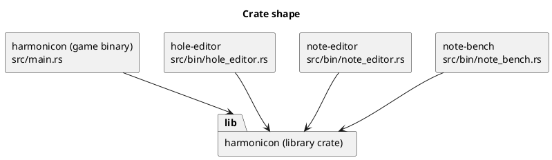
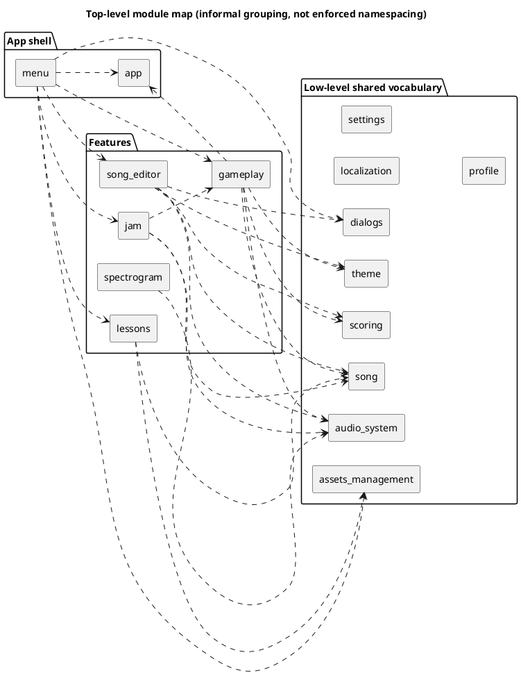

# System Overview

Harmonicon is a rhythm game for diatonic and chromatic harmonica, written
in Rust on top of the [Bevy](https://bevyengine.org/) game engine (version
0.19). The player plays a *real* harmonica into a microphone; the game
listens, detects the pitch being played in real time, and scores it
against a scrolling chart — the same core loop as any note-highway rhythm
game (Guitar Hero, Clone Hero, osu!), except the "controller" is an
acoustic instrument and a live audio pipeline instead of a button press.

## The single-crate-with-many-modules shape

Harmonicon is one Cargo package (`harmonicon`, `edition = "2024"`)
structured as a **library plus several binaries**, not a Cargo workspace
of many crates. `src/lib.rs` is the library root; `src/main.rs` (the game
itself) and everything in `src/bin/` (`hole-editor`, `note-editor`,
`note-bench` — small developer tools, described in
[Testing Strategy](testing-strategy.md) and the [Song Editor](
song-editor-architecture.md) chapter) are separate binary crates that
depend on that library and share every subsystem through it. This is a
deliberate, low-ceremony choice: a full Cargo workspace with separate
crates per subsystem would enforce dependency direction at the compiler
level (a real advantage — see [Module Boundaries and Dependency Rules](
module-dependency-rules.md) for how those rules are enforced *without*
that today), but at this project's size the extra `Cargo.toml`
boilerplate, the friction of moving code between crates while a module's
boundaries are still being found, and the loss of being able to freely
`pub(crate)` things across what would become crate boundaries outweigh
that benefit. The module tree inside the one library crate mirrors what
separate crates would look like closely enough that splitting it later,
if the project ever grows to need that, is a mechanical refactor rather
than a redesign.

## The top-level modules

`src/lib.rs` re-exports every subsystem as a `pub mod`. Roughly grouped
by what they're *for* (this grouping is informal — Rust doesn't nest
these into sub-namespaces beyond the module tree itself, and the
["Module Boundaries" chapter](module-dependency-rules.md) covers the
actual, enforced dependency rules between them):

**Low-level, widely shared vocabulary** — depended on by almost
everything else, and deliberately kept ignorant of the features built on
top of them:

- [`song`](chart-and-assets.md) — the chart file format (`HarpChart`),
  harmonica layouts and tunings, MIDI-file parsing, and the custom
  [`AssetLoader`](chart-and-assets.md) that turns a chart folder on disk
  into a loaded `SongManifest`.
- [`audio_system`](audio-pipeline.md) — microphone capture (`cpal`), the
  five pitch-detection algorithms, the additive harmonica-voice
  synthesizer used for playback previews and generated backing, and WAV
  encode/decode helpers.
- `theme`, `localization` — see [Localization and Theming](
  localization-and-theming.md).
- `settings`, `profile` — see [Persistence](persistence.md).
- `dialogs` — shared, generic UI widgets (buttons, comboboxes, file
  dialogs, tooltips, scroll areas) used by every screen in the game;
  intentionally has no idea what a "song" or a "harmonica" is.
- `assets_management` — non-chart asset discovery (which songs, themes,
  harmonica 3D models, and note-head themes exist) and the live
  filesystem watcher for the `~/Harmonicon` external content folder.
- `scoring` — the *pure*, timing-window/combo-multiplier math shared by
  real gameplay and the Song Editor's own practice mode. Deliberately
  just functions operating on plain data, no ECS types at all — see
  [The Scoring System](scoring-system.md).

**Features built on that vocabulary:**

- [`gameplay`](gameplay-clock.md) — the scored Play 2D/3D modes, the
  gameplay clock, the Bending Trainer, and every in-song HUD overlay.
  Also where `AppState::Playing`'s system schedule is assembled for
  *every* `GameplayMode` (2D, 3D, and Jam Session) — see the
  composition-root discussion in [Module Boundaries](
  module-dependency-rules.md).
- [`jam`](jam-session-architecture.md) — free-play Jam Session, the
  generated 12-bar backing track, MIDI multi-track backing, and the
  improv/call-and-response practice modes.
- [`lessons`](lessons-engine.md) — the guided curriculum: lesson
  manifests, catalog discovery, prerequisite gating, and per-player
  progress.
- [`song_editor`](song-editor-architecture.md) — the in-game chart
  authoring tool.
- `spectrogram` — the live audio visualizer (bar spectrum and
  oscilloscope styles), reusing the same `AudioFrame` the pitch pipeline
  already publishes rather than re-analyzing audio itself.
- `menu` — every menu screen, app-level state routing, and the guided
  tutorial tour.
- `app` — pure, feature-agnostic vocabulary shared *across* features:
  `AppState`, `GameplayMode`, the currently-selected song, and a handful
  of "which menu page to land on when this state exits" routing flags.
  See [Application States and Modes](app-states.md).
- `note_bench` — pure comparison logic for the pitch-detection benchmark
  tool (`note-bench`); see [Testing Strategy](testing-strategy.md).

## The engine and its major dependencies

Beyond Bevy itself, a handful of dependencies carry specific,
non-interchangeable responsibilities worth knowing about up front — each
gets its own discussion in the chapter its responsibility belongs to:

| Crate | Role | Discussed in |
|---|---|---|
| `bevy` 0.19 | ECS, rendering, UI, audio playback, asset system | throughout |
| `cpal` | Cross-platform microphone capture | [Audio Pipeline](audio-pipeline.md) |
| `rustfft` | FFT for pitch detection and the spectrogram | [Audio Pipeline](audio-pipeline.md) |
| `midly` | MIDI file parsing | [Chart Format](chart-and-assets.md), [Jam Session](jam-session-architecture.md) |
| `serde_json` / `jsonschema` | Chart/theme/lesson JSON parsing and schema validation | [Chart Format](chart-and-assets.md) |
| `bevy_fluent` / `fluent_content` | Fluent-based localization | [Localization and Theming](localization-and-theming.md) |
| `figment` | Layered settings-file loading | [Persistence](persistence.md) |
| `notify-debouncer-full` | Filesystem watching for `~/Harmonicon` | [Persistence](persistence.md) |
| `rodio` (decode-only) | OGG/WAV waveform pre-analysis | [Chart Format](chart-and-assets.md) |

## Where to go next

If you're orienting yourself for the first time, read
[The Plugin Architecture](plugin-architecture.md) and
[Application States and Modes](app-states.md) next — together they
describe the skeleton every other chapter's subsystem hangs off of.
