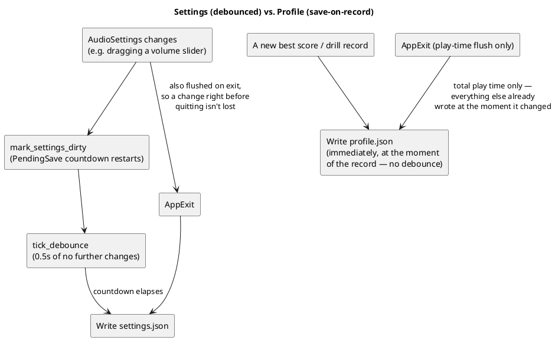
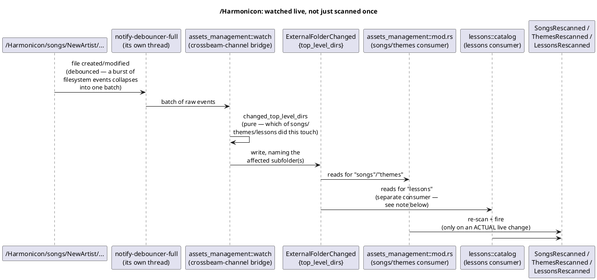

# Persistence

Harmonicon persists three distinct kinds of state to disk, each with a
deliberately different save strategy, plus a live filesystem watcher
that makes one particular directory (`~/Harmonicon`) behave like a
content source the game keeps in sync with, not just a place it reads
from once at startup. This chapter covers all three save paths and the
watcher.

## Settings vs. profile: two save strategies for two access patterns

`settings.rs` (`AudioSettings` and friends — volume levels, the chosen
pitch algorithm, input device, latency calibration, UI theme, adaptive
difficulty on/off) and `profile.rs` (`PlayerProfile` — per-song best
scores, per-technique best accuracy, Bending Trainer drill records,
total play time) both persist to JSON under the platform config
directory — `harmonicon_platform::paths::config_dir`, the single answer to
"where do we write", `#[cfg]`-split because Android has no such thing as an
XDG config directory (`dirs::config_dir()` returns `None` there, so every
save silently no-opped and all progress was lost on exit; the sandbox path
comes from `AndroidApp::internal_data_path()` instead). Loading goes through
`figment`, layered so a fresh install gets sensible
defaults without a config file needing to exist yet, but they save on
opposite schedules, matched to how often each actually changes:

**Settings are debounced** because a slider drag can fire many change
events per second — writing a file on every single one would be wasteful
disk I/O for no benefit, since only the *final* value after the player
stops dragging actually matters. `PendingSave` restarts a 0.5-second
countdown on every change; `tick_debounce` writes once it elapses with
no further changes in the meantime, and `AppExit` flushes unconditionally
so a change made right before quitting is never silently lost to an
in-flight debounce that never got to fire.

**The profile deliberately has no debounce machinery at all.** A new
best score or drill record is inherently a rare, discrete event (once
per song completion at most, not many times a second), so there's
nothing to batch — writing immediately, at the exact point the record
changes, is both simpler and loses no more data on an unexpected exit
than debouncing would. The one thing that *does* accumulate
continuously — total play time — is the one field flushed on `AppExit`
rather than written continuously, for the ordinary reason: nobody wants
a disk write every frame for a number nobody's watching in real time.

## `~/Harmonicon`: a second asset root, watched live

Beyond the bundled `assets/` tree, Harmonicon registers a second,
optional `AssetSource` (`external://`, mapped to `~/Harmonicon` — see
[The Plugin Architecture](plugin-architecture.md) for why this has to be
registered before `DefaultPlugins`) so a player can drop in their own
songs, themes, and lessons without touching the install directory at
all — and, going a step further, without even restarting the game.

A few design choices here are worth calling out:

- **The watcher module itself is agnostic of what any subfolder
  *means*.** `assets_management::watch` fires one generic
  `ExternalFolderChanged{top_level_dirs}` message naming which immediate
  subfolders changed, without knowing or caring that `songs` means
  something to `assets_management` and `lessons` means something to a
  completely different module. `lessons::catalog` is its own,
  independent consumer of the same message — a `lessons`-depends-on-
  `assets_management` edge, never the reverse, since `assets_management`
  is meant to be generic, low-level shared vocabulary (see
  [Module Boundaries and Dependency Rules](module-dependency-rules.md)).
- **A dedicated `*Rescanned` message, not just "the resource changed."**
  A menu page reacting to `resource_changed::<AvailableSongs>` would
  also see it as "changed" on the ordinary one-time Startup scan, and
  again every time the page re-enters and its own change-detection tick
  happens to fall after some unrelated write — `SongsRescanned`/
  `ThemesRescanned`/`LessonsRescanned` fire *only* when a live watcher
  event actually triggered a re-scan, which is the one distinction a
  menu page genuinely needs ("did something new just appear while I was
  sitting here" vs. "this resource simply exists").
- **Every scan function fully replaces its resource's contents**, rather
  than appending — making every one of them safe to call a second time
  at runtime, not just once at Startup. This wasn't always true (some
  scan functions used to only ever run once and assumed that), and
  fixing it was a prerequisite for live rescanning to be correct at all:
  an appending scan run twice would duplicate every previously-found
  entry.
- **Deliberately *not* built on Bevy's own asset-hot-reload path.** Bevy
  can watch and hot-reload already-loaded assets, but that's useless
  here specifically because the content this watcher cares about was
  often *never loaded in the first place* — a brand-new song the player
  just dropped in has no existing `Handle` for Bevy to reload. Separately,
  whether Bevy's own watching is on at all is one global flag applied
  uniformly to every registered `AssetSource` — enabling it for
  `external://` would also silently enable asset hot-reloading for the
  bundled `assets/` tree in shipped builds, which is explicitly a
  `--features dev`-only behavior everywhere else in the project.

None of this watcher infrastructure exists under wasm — there's no
concept of a home directory, let alone a filesystem to watch, inside a
browser sandbox. See [Native vs. WebAssembly](cross-platform-wasm.md)
for what that means concretely (nothing wasm-specific was needed; the
native code already handles `dirs::home_dir()` returning `None`
gracefully) and for the persistence gap that *is* still open there
(settings/profile storage has no browser-compatible replacement yet).
