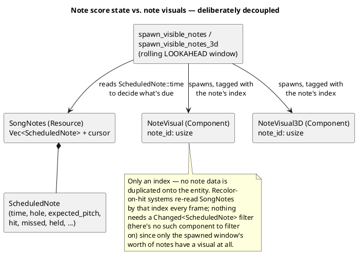
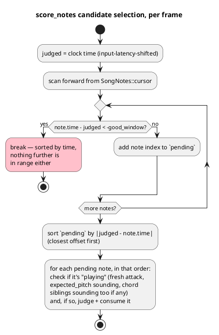

# The Scoring System

Scoring is split cleanly into two layers: **pure functions with no ECS
dependency at all** (`src/scoring.rs`, top-level, shared by real
gameplay *and* the Song Editor's practice mode) that decide "given this
timing offset and this configuration, what quality is this hit," and a
**driving ECS system** (`gameplay::judge::score_notes`, plus its
supporting resources in `gameplay::state`) that feeds real per-frame
pitch/clock data into those functions and applies the result to game
state. This chapter covers both layers and the data-model decision that
sits underneath them: why scored notes live in a plain resource instead
of as ECS components.

## Why note state is a resource, not components

It would be reasonably idiomatic Bevy to give every chart note its own
entity with a `Note` component carrying its score state. Harmonicon
doesn't do this. Instead, `SongNotes` (`gameplay/notes.rs`) is a
`Resource` holding a plain `Vec<ScheduledNote>` (the *entire* chart,
loaded once) plus a `cursor` (the index of the first not-yet-resolved
note). `ScheduledNote` is plain data — no `Component` derive, nothing
ECS-specific about it at all.

This decoupling is what makes several other things in the codebase
simple that would otherwise be awkward:

- **Only a rolling window of notes needs a visual at all.**
  `notes_needing_spawn` (a pure function, shared by the 2D and 3D
  renderers) answers "which notes should have a visual right now but
  don't" by binary-searching `SongNotes::notes` (kept sorted by `time`)
  for the `LOOKAHEAD`-second window around the playhead — a whole song
  is typically hundreds of notes, but only a handful are ever visible
  (and thus need an entity) at once. If score state lived *on* the
  entity, a note leaving the lookahead window would either need to
  destroy and later reconstruct its own progress, or the despawn logic
  would need special-casing to preserve it — with the split, an entity
  can freely despawn and later respawn fresh, because its score state
  was never at risk of being lost with it.
- **Looping resets state with a slice mutation, not an ECS query.**
  `clock::handle_loop_boundary` resets every note inside the loop range
  back to "unresolved" with a binary-search-bounded slice mutation over
  plain data, rather than a `Query` over however many of those notes
  happen to currently have a live entity (most of them won't, being
  outside the lookahead window).
- **Recolor-on-hit systems need no `Changed<T>` filter.** `ScheduledNote`
  isn't a component, so there's nothing to filter a `Query` on for
  "did this note's score state change since last frame." Instead,
  `update_note_visuals*` just re-syncs every currently-*spawned* visual's
  color from `SongNotes` every frame — cheap, because (per the point
  above) only the lookahead window's worth of notes ever have a visual
  to update in the first place.

## Pitch identity: a `u8`, not a string

Every place scoring needs to compare "what pitch is the player playing"
against "what pitch does the chart expect," both sides are a MIDI note
number (`u8`) — `PitchInfo::midi`, `ScheduledNote::expected_pitch:
Option<u8>` (`None` for a hole/technique combination the harp simply
can't produce, which can therefore never be hit), `PitchGate`'s
`consumed: HashSet<u8>`. This is what lets the hot per-frame comparison
be an integer equality check with zero allocation, and — a correctness
detail, not just a performance one — it rules out enharmonic mismatches
(`"A#4"` vs `"Bb4"`) entirely, since they're the same integer. Display
strings (`note`/`octave` on `PitchInfo`, the harmonica's own
`wind_direction_label`) still exist purely for what the player *sees*;
they are never compared against each other for scoring purposes.

## `score_notes`: candidate selection

`judge::score_notes` runs every frame (as part of `GameplayLogic`, see
[The Gameplay Clock](gameplay-clock.md)) and has to answer "which of
however many notes are currently near the playhead did the player's
detected pitches just satisfy?" It does this in two passes over
`SongNotes`, both leaning on the notes being sorted by `time`:

Sorting candidates by `|offset|` before judging — rather than judging in
whatever order they happen to appear in the chart — is what makes two
overlapping same-pitch notes resolve deterministically: the *closer* one
claims the played pitch first, so a played note can never be credited to
the wrong one of two nearby candidates just because of iteration order.
The early `break` (not `continue`) on the first out-of-range note is
possible, and correct, specifically *because* the notes are sorted and
the scan starts from `cursor` — nothing beyond that point can be in
range either, so there's no reason to keep scanning a long chart's
entirely future notes every single frame.

## Fresh-attack gating: `PitchGate`

A note only counts as "being played" on a genuine new attack, not merely
"this pitch happens to still be sounding from a moment ago" — otherwise
a single long blow could be re-credited to every note at that pitch in
a row. `PitchGate` (`gameplay/state.rs`) wraps `scoring::AttackGate<u8>`,
a small pure state machine keyed by MIDI note number that tracks which
pitches are "fresh" (just started sounding) versus "already consumed"
by an earlier note's hit — the same primitive Jam Session's own
`ImprovStats` accumulator reuses for its own fresh-attack gating,
despite scoring nothing.

## Chord and octave-split notes

A chart `TrackItem` with more than one simultaneous `events` entry
(`PlayMode::Chord`/`Split`) still produces one `ScheduledNote` per event
— but every sibling note carries the *same* `chord_pitches: Vec<u8>`,
the full target set for that item. `score_notes` ANDs a
`chord_is_sounding` check (every pitch in the set present at once) into
each sibling's own per-pitch freshness check, so a chord only scores
when its members are struck *together* — playing the same holes one at
a time doesn't satisfy it. This needed no chart-schema change at all:
multi-event `TrackItem`s already existed (for the visual chord/split
badge); nothing previously required their events to actually sound
together, and `chord_pitches` is empty (a no-op AND) for the
overwhelmingly common single-event case.

## Where the pure/ECS boundary actually sits

`src/scoring.rs` — outside `gameplay/` entirely, at the crate's
top level — contains every function that decides *quality* from a
timing offset and a `ScoringConfig`: the perfect/good/miss timing-window
classification, combo/multiplier math, style-bonus point values, and
`AttackGate<K>` itself. None of it touches a `World`, a `Query`, or any
Bevy type. This is what lets the Song Editor's practice mode
(`song_editor::practice`) share the *exact* same judging math real
gameplay uses — scoring a player's mic input against the chart being
edited — without depending on any part of `gameplay`'s ECS machinery at
all, and it's what makes this layer straightforward to unit test
directly against plain inputs and expected outputs rather than needing a
`World`/`Schedule` harness (see [Testing Strategy](testing-strategy.md)
for the project-wide convention this exemplifies: pure functions and
their tests first, the ECS system that drives them second).
