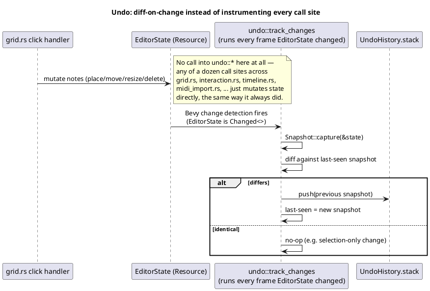
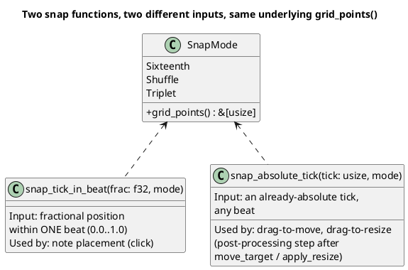

# The Song Editor

The Song Editor (`src/song_editor/`, ~15,000 lines across roughly thirty
files) is Harmonicon's largest single feature: a full in-game chart
authoring tool built around one central document resource, a piano-roll
grid, and enough surrounding tooling (live recording, MIDI import,
undo/redo, a real tempo map, lesson authoring) that it functions as a
small application in its own right, running inside `AppState::
SongEditor2`. This chapter describes how that document is modeled, how
the ~30 files are split by responsibility, and the design of a few of
its more intricate features.

## `EditorState`: one resource, the whole document

Everything the editor is currently working on — every placed note, the
tempo map, the meta-form fields (key, tempo, harmonica type, position,
scale, lesson metadata), the current selection, drag state, which mode
is active — lives on one `Resource`, `EditorState` (`song_editor/
state.rs`). This mirrors the same "plain data resource, not scattered
across components" choice [The Scoring System](scoring-system.md)
describes for `SongNotes`, for a very similar reason: the editor's
"document" needs to be trivially snapshot-able (for undo — see below),
diffable, and serializable to a `.harpchart`, none of which is
convenient if a note's data is spread across ECS component storage.

`GridNote` (the editor's own per-note type — distinct from gameplay's
`ScheduledNote`, since the editor's notes carry authoring-time fields
gameplay's scored notes don't, like a stable `id` used for
selection/undo) is plain data too: `{ id, hole, tick, len, dir, pitch,
expr }`.

## How the module is split

```plantuml
@startuml
title song_editor/ — responsibility split (selected modules)
skinparam componentStyle rectangle

package "Document model" {
  [state.rs\n(EditorState, GridNote)] as state
  [snap.rs\n(SnapMode, tick snapping)] as snap
  [undo.rs\n(snapshot diffing)] as undo
  [clipboard.rs\n(copy/paste)] as clipboard
}

package "Grid interaction" {
  [grid.rs\n(rendering, click/drag observers)] as grid
  [interaction.rs\n(keyboard, selection helpers)] as interaction
  [ranges.rs\n(silence-gap detection)] as ranges
  [timeline.rs / timeline_overlay.rs\n(Select/Erase/Remove/Tempo tools)] as timeline
}

package "Playback & audio" {
  [playback.rs\n(shared synth-driving helpers)] as playback
  [practice.rs\n(mic-scored practice mode)] as practice
  [record.rs\n(live recording)] as record
  [metronome.rs\n(click track, count-in)] as metronome
  [audition.rs\n(note-selection blip)] as audition
}

package "Import / export" {
  [harpchart.rs\n(save/load .harpchart)] as harpchart
  [midi_import.rs\n(MIDI → grid notes)] as midi_import
  [pitch_map.rs\n(pitch → harp resolution)] as pitch_map
  [lesson_form.rs\n(lesson.json authoring)] as lesson_form
  [save_feedback.rs\n(status-bar save/load outcomes)] as save_feedback
}

package "UI shell" {
  [panel.rs / mod_panel.rs / panel_widgets.rs] as panel
  [meta_form.rs] as meta_form
  [ui.rs\n(marker components)] as ui
  [material.rs\n(note-cell shader material)] as material
  [scroll.rs / waveform.rs] as scroll
}

grid ..> state
interaction ..> state
undo ..> state
timeline ..> state
practice ..> state
record ..> state
midi_import ..> state
midi_import ..> pitch_map
harpchart ..> state
panel ..> state
meta_form ..> state
@enduml
```

This split follows a consistent pattern also visible elsewhere in the
codebase (see [Module Boundaries and Dependency Rules](
module-dependency-rules.md)): most files aren't "a layer," they're "one
feature, factored out once it grew large enough to justify its own
file" — `snap.rs`, `audition.rs`, `save_feedback.rs`, `metronome.rs`,
and `undo.rs` were all split out of `state.rs`/`mod.rs` specifically to
stay under the project's enforced per-file line budget (see
[Testing Strategy](testing-strategy.md)), not because of some deeper
layering principle. The underlying rule that *is* structural, not
incidental: pitch-to-harp resolution (`pitch_map.rs`) is shared, not
duplicated, between MIDI import and live recording, even though the two
want opposite fallback behavior when a pitch doesn't map cleanly onto
the harp (import always finds *something* playable, so an imported
track never has gaps; recording discards a detection it can't map
cleanly, so raw pitch-detector noise never disguises itself as a
plausible note).

## Undo/redo: snapshot diffing, not command objects

The editor's undo system (`undo.rs`) is **snapshot-based**, not
command-based. A command-based undo system (each mutation pushes an
explicit "undo this specific action" closure or enum onto a stack) is
the more common pattern, but it requires instrumenting every single
mutation call site — every note placement, drag, resize, delete, paste,
Erase/Remove, MIDI import — to *know* it needs to record undo
information, which is a lot of individually-easy-to-forget call sites in
an editor this large.

Harmonicon's `undo::track_changes` instead runs once every frame
`EditorState` changes at all, diffing a lightweight `Snapshot` (just
`notes` and `tempo_changes` — deliberately *not* the whole
`EditorState`, excluding transient fields like `selected`/`scroll_beat`/
`dragging` that shouldn't count as "an edit" for undo purposes) against
the last-seen snapshot, and pushes the *previous* one onto the undo
stack only when they actually differ:

This means adding a *new* note-mutating feature needs **zero**
integration work with undo — whatever it does to `EditorState.notes`/
`tempo_changes` is caught generically on the next diff pass, which is
exactly why undo support didn't need to be re-derived when MIDI import,
paste, and the timeline tools were each added afterward. The one
deliberate exception is **live recording**: a note's length grows every
single frame while a take is running, so diffing continuously would
flood the history with one entry per frame of growth — `track_changes`
simply skips while `RecordState::active`, so an entire take (onset
through Stop/Finish, pauses included) becomes one undo step, not
hundreds. `undo()`/`redo()` themselves also keep the cached "last"
snapshot in sync, so the very next `track_changes` pass after either one
correctly reads as a no-op rather than a spurious new edit that would
otherwise clear the redo stack.

## The grid-snap feature: a case study in scoped extension

The grid's snap-to-beat-subdivision feature (`SnapMode` — Straight
16ths, Shuffle, Triplet) is a useful worked example of incremental,
carefully-bounded architecture change, because it was built in two
passes that make a good illustration of "ship the minimum, verify, then
extend deliberately":

1. **First pass**: `TICKS_PER_BEAT` (shared with `audio_system::synth` —
   see [The Audio Input Pipeline](audio-pipeline.md)) went from 4 to 12,
   the lowest resolution divisible by both 4 (straight 16ths) and 3
   (triplets) — a true triplet position simply doesn't exist as an
   integer tick on a 4-ticks-per-beat grid, so this had to be a
   resolution change, not a smarter snapping function on the old grid.
   `snap_tick_in_beat` (a pure function taking a *fractional* position
   within one beat cell — a click's normalized offset) was wired into
   the note-placement click handler only.
2. **Verification surfaced a scope gap**: manual testing found dragging
   and resizing an *existing* note showed no visible difference between
   snap modes — because `move_target`/`apply_resize` (the pure functions
   computing a drag's resulting tick) had no `SnapMode` input at all,
   by design at the time. Whether that was the *right* final scope was
   a real, open question, not a bug — dragging free-form and only
   snapping fresh placements is a defensible design on its own.
3. **Second pass, after confirming the broader scope was wanted**:
   `snap_absolute_tick` (a *second* pure function, taking an
   already-absolute tick rather than a within-one-beat fraction — drag
   deltas can cross beat boundaries, which the placement-only function
   was never built to handle) is applied as a post-processing step at
   each drag observer's call site. `move_target`/`apply_resize`
   themselves stay completely snap-agnostic — snapping is layered on
   *after* calling them, not threaded through their own signatures —
   which is why their existing unit tests needed zero changes when this
   landed.

The broader lesson this illustrates: a feature's *first* correct,
tested, shipped version does not have to cover every place a related
concept applies — placing a note and dragging one are related but
distinct interactions, and it was legitimate to ship the first as its
own complete unit, confirm with the person who'd actually use it whether
the second needed the same treatment, and only then extend — rather
than either guessing at the full scope up front or leaving the gap
undiscovered.

## Save/load and the schema/version contract

Saving serializes `EditorState` into the same `.harpchart` JSON shape
[Chart Format and Asset Loading](chart-and-assets.md) describes,
through `harpchart::serialize_harpchart`, and validates the result
against the same schema before writing — an editor that could produce a
chart its *own* game engine then refuses to load would be a uniquely
bad experience. Save/load outcomes surface in the status bar (not just
the log) via `save_feedback::SaveFeedback`, a small resource with a
message and a countdown timer, displayed as the status bar's
highest-priority tier for a few seconds before falling back to whatever
it would otherwise show (a count-in countdown, a drag-validity message,
recording/practice status).

## Where MIDI enters: import, not runtime backing

The Song Editor's `midi_import.rs` is the *authoring*-side use of MIDI
files, distinct from — but built on the same underlying `song::midi`
parsing primitives as — the *runtime* MIDI-backing feature described in
[Jam Session](jam-session-architecture.md). Picking a MIDI file lists
its tracks in a combobox; picking a track quantizes its notes onto the
editor's tick grid and resolves each pitch onto the currently selected
harp key via `pitch_map::map_pitch` (an exact match, else a bend or
slide, else the nearest playable note — reusing the exact same
compatibility check the editor's own UI enforces, so an import can never
produce a note the grid wouldn't otherwise let you place by hand).
Saving while a track is selected also writes a synthesized WAV mixdown
of every *other* track as `song/music.wav`, via the same additive synth
[The Audio Input Pipeline](audio-pipeline.md) describes — this predates,
and is a different design point from, the newer `song/music.mid`
per-track-stem backing Jam Session can use instead.
