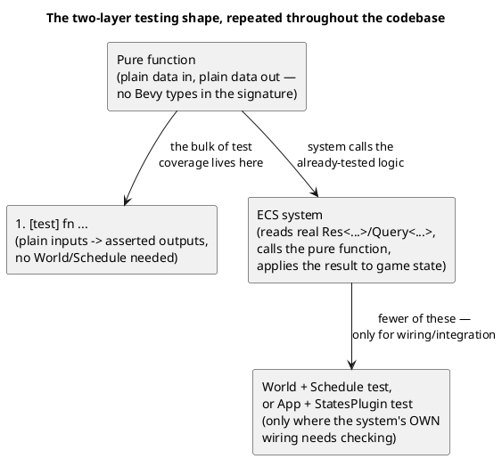

# Testing Strategy

Harmonicon's test suite (several hundred `#[test]` functions across
`src/`, plus a handful of top-level integration tests in `tests/`)
follows a consistent, project-wide convention: **pure functions and unit
tests first, the ECS system that drives them second** — and, alongside
the ordinary test suite, a set of *build-time* static checks that catch
a specific class of bug no amount of unit testing would reach, because
the bug isn't in any function's logic at all. This chapter covers both.

## Pure functions and unit tests first

Wherever a new mechanic has any logic worth getting right — timing-
window classification, tick-to-seconds conversion, snap-point selection,
prerequisite gating, drift-correction math — that logic is written as a
plain function taking plain data and returning plain data, with no
`World`, `Query`, `Res`, or other ECS type anywhere in its signature,
*before* the ECS system that calls it with real per-frame values exists.
[The Scoring System](scoring-system.md), [The Gameplay Clock](
gameplay-clock.md), [The Song Editor](song-editor-architecture.md)'s
snap functions, and [The Lessons Engine](lessons-engine.md)'s
`is_unlocked` are all examples this book has already covered in depth;
the pattern repeats throughout the rest of the codebase at the same
density.

The reason this ordering matters, not just "having both kinds of test"
in the abstract: pure-function tests are fast, don't need any Bevy
scaffolding, and pin down the actual *logic* precisely — as the [Song
Editor chapter](song-editor-architecture.md)'s grid-snap case study
shows, this is what makes it cheap to verify a change like "does
`snap_absolute_tick` correctly wrap across a beat boundary" in isolation,
without also standing up a `World` and simulating a drag gesture through
it. ECS-level tests are reserved for what can only be verified with real
Bevy machinery involved: system *ordering*, state-transition behavior,
whether a resource actually gets initialized — using either a minimal
`World` + `Schedule` (for a handful of systems in isolation) or a full
`App` + relevant plugins (for state-transition-dependent behavior,
`menu/mod.rs`'s and `gameplay/tests.rs`'s style).

## Static checks that run at *build* time, not test time

A small number of correctness properties in this codebase are checked
by `build.rs` itself — meaning a violation fails `cargo build`
(and thus `cargo test`, `cargo run`, everything) before a single test
even runs. Both exist because the failure mode they catch is a runtime
panic, not a compile error, and one that's easy to introduce without
noticing and easy to miss until the exact code path happens to execute:

- **Localization enforcement** — `build.rs` scans every source file for
  a handful of known sink shapes (`Text::new("...")`, a `bsn!` literal
  binding, a fixed list of shared label-spawning helpers) and fails the
  build on a literal that looks like natural-language text. See
  [Localization and Theming](localization-and-theming.md).
- **Message registration** — every `#[derive(Message)]` type must
  appear in some `.add_message::<T>()` call somewhere in the codebase,
  or Bevy panics at runtime the first time a system's
  `MessageReader`/`MessageWriter` for it actually runs — which can be
  well after the type was first added, since the type itself compiles
  fine unregistered. `build.rs` cross-references every declared message
  type against every registration call, statically. See
  [The Plugin Architecture](plugin-architecture.md).

Both scans are intentionally simple, line-oriented text matching rather
than a real parse of the Rust source (documented explicitly in
`build.rs`'s own module comment, including the specific patterns each
one can and can't see through) — a deliberate scope trade-off: a real
AST-based check would be more precise, but a purpose-built text scan for
these two specific, narrow shapes is far less code, has no parser
dependency, and in practice catches what it's meant to.

## Integration tests: schema validation and physical structure

Three top-level suites under `tests/` check properties that span *many*
files at once, which don't naturally belong inside any single module's
own unit tests:

- **`tests/asset_layout.rs`** — schema-validates every bundled song
  chart, theme, and lesson against their respective JSON schemas, and
  checks completeness (a lesson's referenced chart file actually exists,
  a lesson's prerequisite ids actually resolve to other real lessons,
  a lesson's Fluent keys actually exist in every locale). This is what
  keeps bundled *content* — not code — from silently rotting as the
  schemas or the content itself evolve independently.
- **`tests/physical_design.rs`** — the file-size budget enforcement
  described in [Module Boundaries and Dependency Rules](
  module-dependency-rules.md).
- **`tests/glyph_coverage.rs`** — every character the game draws must
  exist in one of the bundled fonts. A character missing from all of them
  renders as a **tofu box**: it compiles, passes every other test, and is
  visible only in a rendered frame, in the right language. Five shipped
  that way in all three locales before this existed.

  It deliberately reads the **font binaries'** `cmap` tables rather than
  `dialogs::font_fallback`'s hand-maintained lists, because that list is a
  statement of intent — adding a codepoint to it without also re-subsetting
  the `.ttf` leaves the glyph exactly as missing. It covers both locale
  values and `\u{...}` escapes in source, since button icons live in
  source and a locale-only scan would miss every one of them.

  Three deliberate exclusions, each of which was a false positive while
  writing it: `Bravura.otf` counts as coverage (the notation staff draws
  SMuFL private-use codepoints with it), invisible formatting characters
  are skipped (bidi isolates have no glyph by design — `localization::
  strip_bidi_isolates` names U+2068/U+2069 precisely to remove them), and
  nothing below U+2000 is checked.

## Developer tools as their own kind of testing infrastructure

`src/bin/` holds three small binaries, sharing the library crate (see
[System Overview](overview.md)), each existing specifically to make some
kind of manual verification faster than it would be through the full
game:

- **`hole-editor`** — positions the clickable hole overlays on a 3D
  harmonica model, writing the same `holes.json` format
  `gameplay_3d`/`bending_trainer` read at runtime — a visual tool for
  content that would otherwise mean hand-editing pixel coordinates in a
  text editor and reloading to check them.
- **`note-editor`** — a visual editor for the 2D/3D note-head tail
  layout configs (`NoteThemeConfig`/`NoteCube3dConfig` — see
  [Chart Format and Asset Loading](chart-and-assets.md)).
- **`note-bench`** — an *offline pitch-detection benchmark*: replays a
  "debug recording" (raw captured mic audio plus the chart and detection
  metadata, dumped by the Song Editor's own `--features dev` "Debug
  Recording" checkbox) through each of the five selectable algorithms
  (see [The Audio Input Pipeline](audio-pipeline.md)) and reports a hit/
  miss/phantom summary. Its comparison logic lives in the library
  (`note_bench.rs`), not the binary, specifically so it's directly unit-
  testable against synthetic inputs without needing a real recorded WAV
  file — the same "pure logic first" split this whole chapter describes,
  applied to a benchmarking tool rather than a gameplay feature. This
  exists as the deliberate first step of a benchmark-first policy for
  ever touching the detection algorithms themselves: don't change
  detection logic on a hunch, measure it against a reproducible dataset
  first.
