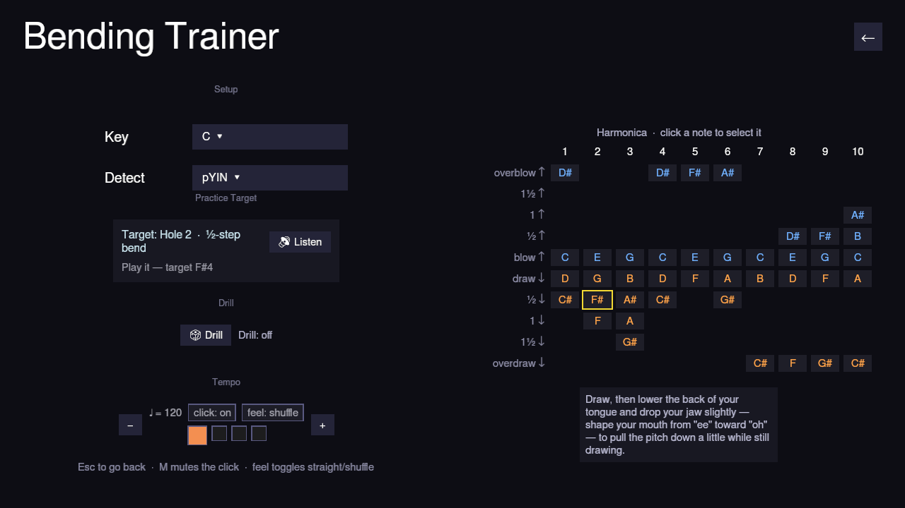

# Bending Trainer

**Play → Bending Trainer** is a standalone ear-training screen — no song,
just the harmonica's full bend diagram, a metronome, and a pitch tuner, for
practicing bends (and overblows/overdraws) in isolation.

The title sits top-left and **Back** top-right, the same header every other
screen uses. Below it, the screen splits into two columns:

- **Left — everything but the harmonica**, grouped into four sections:
  - **Setup** — a **Key** picker and a **Detect** algorithm picker (which
    pitch-detection method to use — the same setting Options uses), both
    dropdowns.
  - **Practice Target** — the current target readout, a **Listen** button
    (plays a synthesized reference tone for it), and a live
    **cents-off tuner readout**.
  - **Drill** — the adaptive Drill toggle; hovering it explains what it does.
  - **Tempo** — the metronome and its BPM steppers.
- **Right — the harmonica**: the full bend diagram (every hole's blow,
  draw, bend, overblow, and overdraw notes), with its explanatory hint text
  beneath it.

## Picking a target

Click any cell in the bend diagram to make it the current target — its
note name appears in the target readout, and **Listen** plays a clean
synthesized reference tone for it so you know exactly what pitch you're
aiming for before you try to bend to it. The **cents-off tuner** then tells
you, live, how far off (and in which direction) the closest pitch you're
actually playing is.

## Drill mode

Turn on **Drill** and Harmonicon picks targets for you, weighted toward
ones you haven't tried yet or have a lower accuracy on — a spaced-practice
loop instead of you deciding what to work on. Your hit rate per
hole/technique is saved across sessions, so Drill mode gets smarter about
what you personally need to practice the longer you use it.

## Leaving

There's no pause menu here (there's no song to pause) — click **Back** in
the header, or press **Esc**, to return to the Play menu. Either way your
drill progress is saved on the way out.
