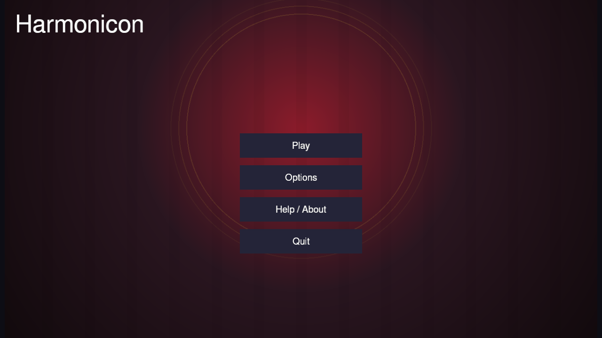

# Introduction

Harmonicon is a rhythm game for **real harmonica**. You play an actual
diatonic or chromatic harmonica into your computer's microphone; Harmonicon
listens, detects the pitch you're playing in real time, and scores it
against a chart scrolling across the screen — the same idea as any
note-highway rhythm game, except the "controller" is an instrument you
already own (or are learning), and every note you score is a note you
actually played correctly.

The goal isn't just a high score. Harmonicon is built to teach blues and
jazz harmonica through play: a structured [Lessons](lessons.md) curriculum
takes you from your first clean single note through bends, chords, and
improvising over a 12-bar blues, and every scored mode gives you honest,
per-technique feedback (not just "hit" or "miss") so you know exactly what
to practice next.

## What's in this book

- **[Getting Started](getting-started.md)** — installing Harmonicon and
  getting your microphone working.
- **Playing** — the [2D](play-2d.md) and [3D](play-3d.md) scored modes,
  free-play [Jam Session](jam-session.md) and its instant
  [Generate a Jam](jam-generate.md) backing, and the
  [Bending Trainer](bending-trainer.md) ear-training drill.
- **[Lessons](lessons.md)** — the guided curriculum, unit by unit.
- **[Song Editor](song-editor.md)** — for authoring or editing your own
  charts.
- **Settings** — [Options](options.md), [input-lag calibration](
  calibration.md), and [visual themes](themes.md).
- **[Controls Reference](controls.md)** and
  **[Troubleshooting](troubleshooting.md)** for when something doesn't
  behave the way you expect.

If you're brand new, the in-game **[Guided Tour](tutorial.md)** (Main Menu →
Help / About → Tutorial) gives you a click-free, under-a-minute walk
through every top-level screen — including a few live seconds of actual
gameplay — a good first stop before diving into this book.
