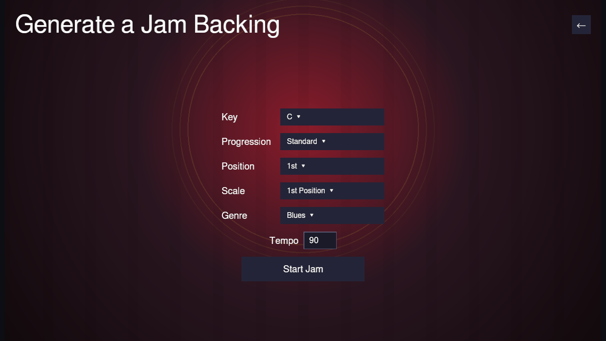

# Generate a Jam

**Play → Jam Session → Generate Jam** skips picking a song entirely: it
synthesizes an endless 12-bar backing on the spot (a swung "blues box" bass
line, not a second harmonica part), so you can jam without needing any
existing content.

Before starting, pick:

- **Key** — a dropdown of all twelve chromatic keys.
- **Progression** — **Standard** (I-I-I-I-IV-IV-I-I-V-IV-I-V, the classic
  12-bar form), **Quick Change** (moves to the IV a bar early), **Minor
  Blues** (the i/iv chords become minor), or **Jazz Blues** (a ii-V-I
  cadence in the last few bars).
- **Position** — which cross-harp position to play in: **1st** (straight
  harp, same key as the jam), **2nd** (cross harp, the classic blues
  choice — a harp a fourth below the jam key), or **3rd** (a harp a whole
  step below).
- **Tempo** — type a BPM value directly (60–160; out-of-range or
  non-numeric input is clamped/corrected once you press Enter or click
  away).

Click **Start Jam** and you're straight into an ordinary
[Jam Session](jam-session.md) — same two-column layout, same live hole-map
feedback, same 12-bar grid — just with a generated backing instead of a
real song's. **Restart** resets the bass to the top of the loop; **Quit
Song** returns to this setup page (with your key/progression/position/tempo
remembered), not the song list, since there was never a song list involved.
